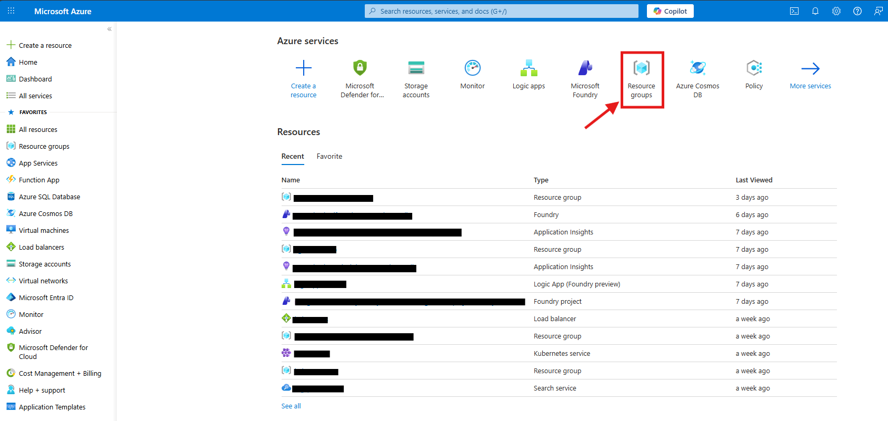
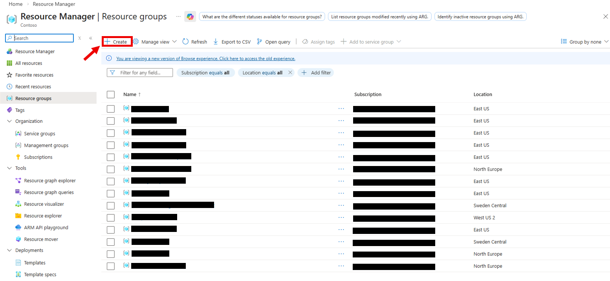
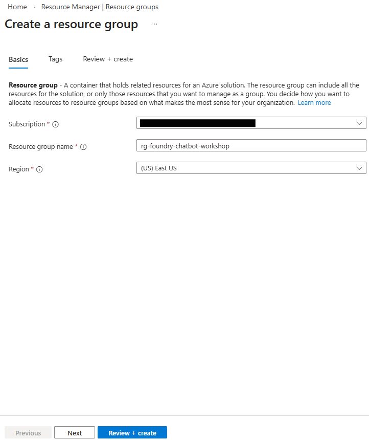
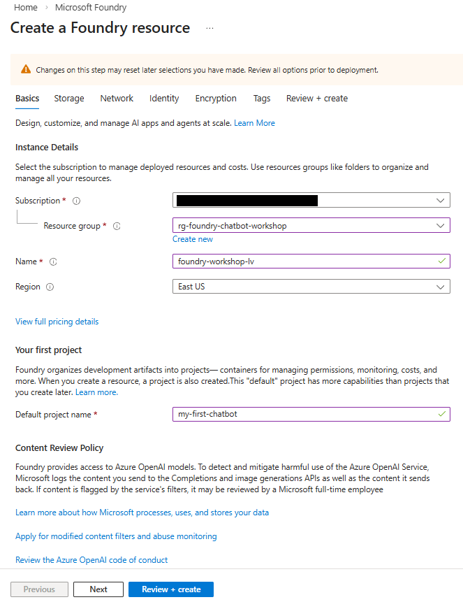
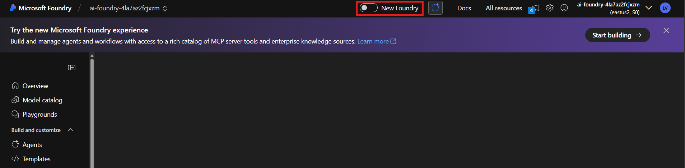
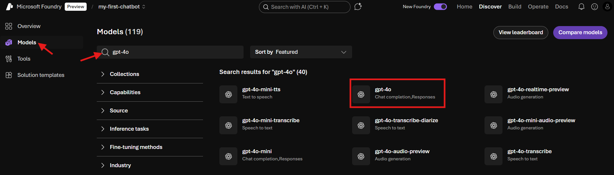

# Sub-Lab 1.1: Set Up Azure Resources

[← Back to Lab 1 Overview](./README.md) | [Next: Sub-Lab 1.2 →](./sub-lab-1.2-prepare-knowledge-base.md)

---

**⏱️ Estimated Time**: 15-20 minutes

## Overview

In this sub-lab, you'll set up Microsoft Foundry and deploy the AI models that power your chatbot:
- **Chat/Reasoning Model** – generates responses to user questions
- **Embedding Model** – converts text into vectors for semantic search

---

## 🎯 Model Options

The models below were chosen for this workshop based on availability and quota limits at the time of writing. For your own projects, you can use newer models (such as GPT-5 or later releases) depending on your needs and regional availability.

### Chat/Reasoning Models

| Model | Description | Best For |
|-------|-------------|----------|
| `gpt-4.1-mini` | Fast, cost-effective GPT-4.1 variant | General use (recommended) |
| `gpt-4.1` | Latest GPT-4 with improved reasoning | Complex reasoning tasks |
| `gpt-4o` | Multimodal model with vision support | Multimodal applications |

### Embedding Models

| Model | Dimensions | Best For |
|-------|------------|----------|
| `text-embedding-3-small` | 1536 | General use (recommended) |
| `text-embedding-3-large` | 3072 | Higher accuracy, larger index |
| `text-embedding-ada-002` | 1536 | Legacy compatibility |

> 💡 **Note**: This workshop uses `gpt-4.1-mini` and `text-embedding-3-small` by default. If you choose different models, update the model names in all subsequent steps.

---

## 🎓 Key Concepts

### What is Microsoft Foundry?

Microsoft Foundry is a unified AI platform that provides:
- **Project Management**: Organize your AI resources and deployments
- **Model Catalog**: Access to GPT, embedding, and other AI models
- **Development Tools**: Build, test, and deploy AI applications
- **Monitoring**: Track usage, costs, and performance

### What are Model Deployments?

A deployment is an instance of a model that you can call via API:
- **Chat/Reasoning Models** (e.g., `gpt-4.1-mini`, `gpt-4.1`, `gpt-4o`): For generating natural language responses
- **Embedding Models** (e.g., `text-embedding-3-small`, `text-embedding-ada-002`): For converting text to vectors

---

## Resources You'll Create

- **Resource Group**: Container for all your Azure resources
- **Microsoft Foundry**: AI platform hub and project
- **Model Deployments**: Chat model (default: `gpt-4.1-mini`) and embedding model (default: `text-embedding-3-small`)

---

## 🖥️ Option: Portal

<details>
<summary><strong>Click to expand Portal instructions</strong></summary>

> ✏️ **Replace [yourname]** with your actual name or identifier (e.g., `jsmith`) throughout these instructions. This ensures your resources are uniquely named.

### 1. Create a Resource Group

1. Go to [Azure Portal](https://portal.azure.com)
2. Click "Resource groups" → "Create"

   
   

3. Configure:
   - **Name**: `rg-foundry-workshop-[yourname]`
   - **Region**: East US 2
4. Click "Review + Create" → "Create"

   

### 2. Create Microsoft Foundry Resource

1. Search for "Microsoft Foundry" in the Azure Portal
2. Click "Create"

   

3. Configure:
   - **Resource group**: `rg-foundry-workshop-[yourname]`
   - **Name**: `foundry-workshop-[yourname]`
   - **Region**: East US 2
   - **Default project name**: `my-first-chatbot`
4. Click "Review + Create" → "Create"

   

### 3. Deploy AI Models

1. Go to your Foundry resource → Click "Go to Foundry portal"
2. Toggle "New Foundry" experience if prompted

   

3. Select your project (`my-first-chatbot`) → "Let's go"

   

4. **Deploy Chat Model** (default: `gpt-4.1-mini`):
   - Go to Discovery → Models
   - Search for `gpt-4.1-mini` (or your chosen model from the Model Options section)
   - Click the model → Deploy → "Default settings"

   
   

5. **Deploy Embedding Model** (default: `text-embedding-3-small`):
   - Repeat for `text-embedding-3-small` (or `text-embedding-ada-002`)
   - Discovery → Models → Search → Deploy → "Default settings"

### ✅ Portal Checkpoint

You should now have:
- [ ] Resource group: `rg-foundry-workshop-[yourname]`
- [ ] Foundry resource with project: `my-first-chatbot`
- [ ] Deployed models: chat model (e.g., `gpt-4.1-mini`) and embedding model (e.g., `text-embedding-3-small`)

</details>

---

## 💻 Option: Code 

<details>
<summary><strong>Click to expand Code instructions</strong></summary>

### 1. Complete Development Environment Setup

Before proceeding, complete the development environment setup:

👉 **[Complete the Setup Guide](../SETUP.md)**

### 2. Verify Prerequisites

Once your environment is ready, open a **Git Bash terminal** and navigate to the main folder. Then verify your setup:

```bash
# Check Azure CLI is installed
az --version
```

> ✅ You should see Azure CLI version **2.50.0 or higher**. If you see a lower version or "command not found", revisit the [Setup Guide](../SETUP.md) to install/update the Azure CLI.

```bash
# Login to Azure
az login
```

> 🔐 **What happens when you run `az login`:**
> 1. A browser window will open automatically
> 2. Sign in with your Azure account credentials
> 3. Once authenticated, return to your terminal
> 4. If you have multiple subscriptions, you'll see a list—note the one you want to use
> 5. (Optional) Set your default subscription:
>    ```bash
>    az account set --subscription "Your Subscription Name or ID"
>    ```
> 6. Verify you're logged in with: `az account show`

### 3. Create Resources via CLI
Copy the instructions below in a text editor, fill in the placeholders and execute in your Git Bash terminal

```bash
# Create resource group
az group create \
  --name rg-foundry-workshop-[yourname] \
  --location eastus2

# Create Foundry resource (with project management enabled)
az cognitiveservices account create \
  --name foundry-workshop-[yourname] \
  --resource-group rg-foundry-workshop-[yourname] \
  --kind AIServices \
  --sku s0 \
  --location eastus2 \
  --allow-project-management

# Create custom subdomain (must be globally unique)
az cognitiveservices account update \
  --name foundry-workshop-[yourname] \
  --resource-group rg-foundry-workshop-[yourname] \
  --custom-domain foundry-workshop-[yourname]

# Create project within the Foundry resource
az cognitiveservices account project create \
  --name foundry-workshop-[yourname] \
  --resource-group rg-foundry-workshop-[yourname] \
  --project-name my-first-chatbot \
  --location eastus2
```

> ✅ **What you just created:**
> - **Resource Group** (`rg-foundry-workshop-[yourname]`): A container that holds all related Azure resources together
> - **AI Services Account** (`foundry-workshop-[yourname]`): The Microsoft Foundry resource that hosts your AI models
> - **Custom Subdomain**: A unique URL endpoint for accessing your AI services
> - **Project** (`my-first-chatbot`): A workspace within Foundry to organize your deployments and configurations

### 4. Deploy Models via CLI

> ✏️ Copy the code below into a text editor, **replace `[yourname]`** with your actual name, then run the commands.

> 💡 **Using different models?** Replace `gpt-4.1-mini` with `gpt-4.1` or `gpt-4o`, and/or replace `text-embedding-3-small` with `text-embedding-ada-002`.

```bash
# Deploy Chat Model (default: gpt-4.1-mini)
# Alternatives: gpt-4.1, gpt-4o
az cognitiveservices account deployment create \
  --name foundry-workshop-[yourname] \
  --resource-group rg-foundry-workshop-[yourname] \
  --deployment-name gpt-4.1-mini \
  --model-name gpt-4.1-mini \
  --model-version "2025-04-14" \
  --model-format OpenAI \
  --sku-capacity 10 \
  --sku-name Standard

# Deploy Embedding Model (default: text-embedding-3-small)
# Alternative: text-embedding-ada-002
az cognitiveservices account deployment create \
  --name foundry-workshop-[yourname] \
  --resource-group rg-foundry-workshop-[yourname] \
  --deployment-name text-embedding-3-small \
  --model-name text-embedding-3-small \
  --model-version "1" \
  --model-format OpenAI \
  --sku-capacity 10 \
  --sku-name Standard

# Verify deployments
az cognitiveservices account deployment show \
  --name foundry-workshop-[yourname] \
  --resource-group rg-foundry-workshop-[yourname] \
  --deployment-name gpt-4.1-mini

az cognitiveservices account deployment show \
  --name foundry-workshop-[yourname] \
  --resource-group rg-foundry-workshop-[yourname] \
  --deployment-name text-embedding-3-small
```

> ✅ **What you just deployed:**
> - **Chat Model** (`gpt-4.1-mini`): Generates natural language responses to user questions—this is the "brain" of your chatbot
> - **Embedding Model** (`text-embedding-3-small`): Converts text into numerical vectors (embeddings) that enable semantic search—this helps the chatbot find relevant information in your knowledge base
>
> The verification commands at the end should return JSON with `"provisioningState": "Succeeded"` for each model.

### 5. Configure Environment Variables

If you haven't done so yet during the initial set-up: Create a `.env` file in the `lab-1-rag-chatbot` directory:

```bash
cp .env.example .env
```

Get your endpoint (found in Foundry Portal on the project welcome screen, or construct it):

```
https://foundry-workshop-[yourname].cognitiveservices.azure.com/
```

Edit `.env` with your endpoint and with your model-names if you didn't pick the default:

```properties
# Foundry Configuration (using Azure Identity - no API key needed)
AZURE_OPENAI_ENDPOINT=https://foundry-workshop-[yourname].cognitiveservices.azure.com/
AZURE_OPENAI_CHAT_DEPLOYMENT=gpt-4.1-mini
AZURE_OPENAI_EMBEDDING_DEPLOYMENT=text-embedding-3-small
AZURE_OPENAI_API_VERSION=2024-02-15-preview
```

> 💡 **Note**: We're using Azure Identity (DefaultAzureCredential) for authentication instead of API keys. This is more secure and uses your `az login` credentials automatically.

> ⚠️ **Important**: Never commit `.env` file to version control!

### ✅ Code Checkpoint

You should now have:
- [ ] Resource group created
- [ ] Foundry resource with project: `my-first-chatbot`
- [ ] Models deployed: `gpt-4.1-mini` and `text-embedding-3-small`
- [ ] `.env` file configured with Foundry credentials

</details>

---

[← Back to Lab 1 Overview](./README.md) | [Next: Sub-Lab 1.2 →](./sub-lab-1.2-prepare-knowledge-base.md)
