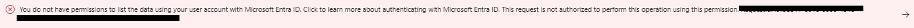

# Sub-Lab 1.2: Prepare Your Knowledge Base

[← Back to Lab 1 Overview](./README.md) | [← Previous: Sub-Lab 1.1](./sub-lab-1.1-setup-azure-resources.md) | [Next: Sub-Lab 1.3 →](./sub-lab-1.3-create-vector-index.md)

---

**⏱️ Estimated Time**: 10-15 minutes

## Overview

In this sub-lab, you'll set up Azure Blob Storage and upload your documents that will form the knowledge base for your chatbot.

## Resources You'll Create

- **Storage Account**: For storing your documents
- **Blob Container**: Organized storage for knowledge base files
- **Documents**: Sample files for the chatbot to learn from

---

## 🖥️ Option: Console

<details>
<summary><strong>Click to expand Console instructions</strong></summary>

### 1. Create a Storage Account

1. Go to [Azure Portal](https://portal.azure.com)
2. Search for "Storage accounts" → Click "Create"

   

3. Configure:
   - **Resource group**: `rg-foundry-chatbot-workshop`
   - **Storage account name**: `stchatbot[yourname]` (must be globally unique, lowercase, no special characters)
   - **Region**: Same as your other resources (e.g., East US)
   - **Performance**: Standard
   - **Redundancy**: Locally-redundant storage (LRS)
4. Click "Review + Create" → "Create"

   

### 2. Create a Blob Container

1. Go to your new storage account (Click "Go to resource")
2. In the left menu, click "Containers" under "Data storage"
3. Click "+ Container"
4. Configure:
   - **Name**: `knowledge-base-container`
   - **Anonymous access level**: Private
5. Click "Create"

   

### 3. Upload Your Documents

1. Click on your `knowledge-base-container`
2. Click "Upload"
3. Select files from the `data/knowledge_base/` folder:
   - `company_info.txt`
   - `policies.txt`
4. Click "Upload"

   

> ⚠️ **Warning: Permissions Error?**
>
> If you see: *"You do not have permissions to list the data using your user account with Microsoft Entra ID..."*
>
> 
>
> **Solution - Grant yourself data plane permissions:**
>
> 1. Go to **Access Control (IAM)** on your storage account
> 2. Click **Add** → **Add role assignment**
> 3. Choose role: **"Storage Blob Data Owner"**
> 4. Press **Next**
> 5. Select **"User, group, or service principal"**
> 6. Click **"Select members"** → Select yourself
> 7. Click **Review + assign** (twice)
>
> Log out and back in, then retry the upload.

### ✅ Console Checkpoint

You should now have:
- [ ] Storage account: `stchatbot[yourname]`
- [ ] Container: `knowledge-base-container`
- [ ] Uploaded documents (company_info.txt, policies.txt)

</details>

---

## 💻 Option: Code

<details>
<summary><strong>Click to expand Code instructions</strong></summary>

### 1. Install Dependencies

```bash
pip install azure-storage-blob azure-identity python-dotenv
```

### 2. Create Storage Account via CLI

```bash
# Create storage account
az storage account create \
  --name stchatbot[yourname] \
  --resource-group rg-foundry-chatbot-workshop \
  --location eastus \
  --sku Standard_LRS

# Create container
az storage container create \
  --name knowledge-base-container \
  --account-name stchatbot[yourname] \
  --auth-mode login
```

### 3. Upload Documents Programmatically

Create `scripts/upload_to_blob.py`:

```python
"""
Upload documents to Azure Blob Storage
"""
import os
from pathlib import Path
from azure.storage.blob import BlobServiceClient
from azure.identity import DefaultAzureCredential
from dotenv import load_dotenv

load_dotenv()

STORAGE_ACCOUNT_NAME = os.getenv("AZURE_STORAGE_ACCOUNT_NAME")
CONTAINER_NAME = os.getenv("AZURE_STORAGE_CONTAINER_NAME", "knowledge-base-container")
DATA_FOLDER = Path(__file__).parent.parent / "data" / "knowledge_base"

def upload_documents():
    """Upload all documents from data/knowledge_base to Azure Blob Storage"""
    
    account_url = f"https://{STORAGE_ACCOUNT_NAME}.blob.core.windows.net"
    credential = DefaultAzureCredential()
    blob_service_client = BlobServiceClient(account_url, credential=credential)
    
    container_client = blob_service_client.get_container_client(CONTAINER_NAME)
    
    # Create container if it doesn't exist
    try:
        container_client.create_container()
        print(f"✅ Created container: {CONTAINER_NAME}")
    except Exception as e:
        if "ContainerAlreadyExists" in str(e):
            print(f"📁 Container already exists: {CONTAINER_NAME}")
        else:
            raise e
    
    # Upload each file
    uploaded_count = 0
    for file_path in DATA_FOLDER.glob("*"):
        if file_path.is_file() and file_path.suffix in ['.txt', '.pdf', '.docx', '.md']:
            blob_client = container_client.get_blob_client(file_path.name)
            
            with open(file_path, "rb") as data:
                blob_client.upload_blob(data, overwrite=True)
            
            print(f"📤 Uploaded: {file_path.name}")
            uploaded_count += 1
    
    print(f"\n🎉 Successfully uploaded {uploaded_count} documents!")
    return uploaded_count

if __name__ == "__main__":
    upload_documents()
```

### 4. Update Environment Variables

Add to your `.env` file:

```properties
# Azure Storage Configuration
AZURE_STORAGE_ACCOUNT_NAME=stchatbot[yourname]
AZURE_STORAGE_CONTAINER_NAME=knowledge-base-container
```

### 5. Run the Upload Script

```bash
python scripts/upload_to_blob.py
```

**Expected Output:**
```
📁 Container already exists: knowledge-base-container
📤 Uploaded: company_info.txt
📤 Uploaded: policies.txt

🎉 Successfully uploaded 2 documents!
```

### ✅ Code Checkpoint

You should now have:
- [ ] Storage account created
- [ ] Container with uploaded documents
- [ ] `.env` updated with storage credentials

</details>

---

## 🎓 Key Concepts

### What is Azure Blob Storage?

Azure Blob Storage is Microsoft's object storage solution for the cloud:
- **Blobs**: Binary Large Objects - any type of file
- **Containers**: Logical groupings of blobs (like folders)
- **Storage Account**: Top-level namespace for your data

### Why Blob Storage for RAG?

1. **Scalable**: Handle any amount of documents
2. **Integrated**: Works seamlessly with Azure AI Search
3. **Secure**: Fine-grained access control
4. **Cost-effective**: Pay only for what you store

### Sample Documents

The `data/knowledge_base/` folder contains sample documents:

**company_info.txt** - Company information:
- Company name and founding date
- Products and services
- Contact information

**policies.txt** - Company policies:
- Return policy
- Shipping options
- Customer support channels

---

[← Back to Lab 1 Overview](./README.md) | [← Previous: Sub-Lab 1.1](./sub-lab-1.1-setup-azure-resources.md) | [Next: Sub-Lab 1.3 →](./sub-lab-1.3-create-vector-index.md)
