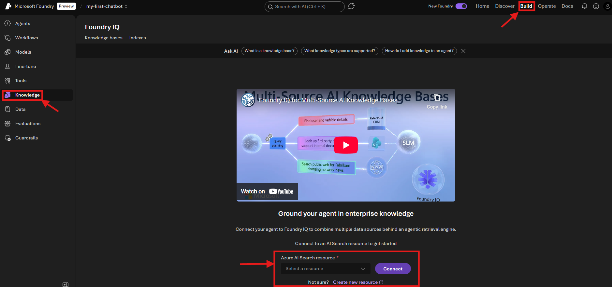
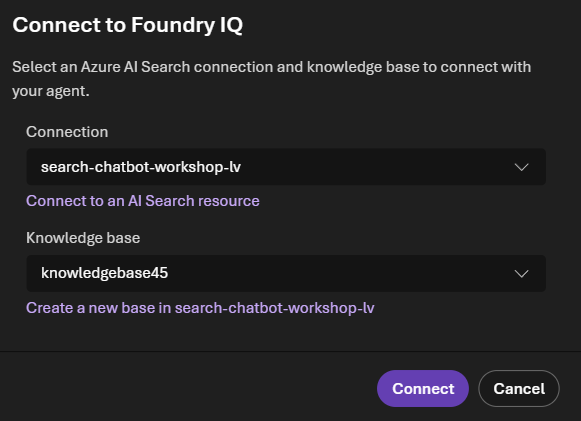
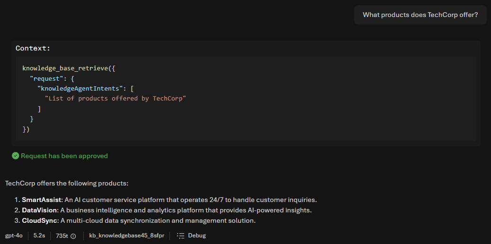

# Sub-Lab 1.4: Create Your Agent in Foundry

[← Back to Lab 1 Overview](./README.md) | [← Previous: Sub-Lab 1.3](./sub-lab-1.3-create-vector-index.md) | [Next: Sub-Lab 1.5 →](./sub-lab-1.5-host-agent-webapp.md)

---

**⏱️ Estimated Time**: 15-20 minutes

## Overview

In this sub-lab, you'll create an AI agent in Microsoft Foundry that uses your vector index to answer questions. The agent combines your chat model (e.g., GPT-4.1-mini) with your indexed documents to provide accurate, context-aware responses.

---

## 🎓 Key Concepts

### What is Foundry IQ?

Foundry IQ is a managed knowledge layer that connects your enterprise data to AI agents. It provides:
- **Multi-source knowledge bases**: Connect Azure Blob Storage, SharePoint, OneLake, and web data
- **Agentic retrieval**: Automatically decomposes complex questions into subqueries, executes them in parallel, and aggregates results
- **Permission-aware responses**: Enforces access control so agents only return content users are authorized to see
- **Grounded answers with citations**: Returns extractive data with sources so agents can trace answers back to documents

### What is a Foundry Agent?

A Foundry Agent is an AI-powered assistant that can:
- **Understand** natural language questions
- **Search** your knowledge base for relevant information
- **Generate** accurate responses based on your documents
- **Cite** sources so users know where answers come from

### What is Microsoft Agent Framework?

Microsoft Agent Framework is an open-source SDK for building AI agents in Python and .NET. It's the unified foundation for building agents, combining the best of Semantic Kernel and AutoGen:
- **Single agents**: Use LLMs to process inputs, call tools, and generate responses
- **Workflows**: Connect multiple agents for complex multi-step tasks
- **Hosted agents**: Deploy agents to Foundry Agent Service for production use

### How the Agent Uses Foundry IQ

When a user asks a question:
1. The agent sends the question to Foundry IQ
2. Foundry IQ uses agentic retrieval to search your indexed content
3. Relevant chunks are returned with citations
4. Your chat model generates a response grounded in your documents

---

## 🖥️ Option: Portal

<details>
<summary><strong>Click to expand Portal instructions</strong></summary>

### 1. Navigate to Foundry Portal

1. Go back to [Microsoft Foundry](https://ai.azure.com)
2. Select your project (`my-first-chatbot`)

### 2. Create a Foundry IQ connection

1. In the top menu, go to Build
2. Go to "Knowledge" on the left
3. Connect to an AI Search resource by selecting your index at the bottom. This allows Foundry IQ to intelligently search between different knowledge sources in the knowledge base
4. choose API Key as the Auth Type. 
5. Press connect

   

### 3. Create a knowledge base in Foundry IQ

1. Click "Create a knowledge base"
2. Choose Azure AI Search Index (under "Configure a knowledge base")
3. Give a description: e.g. `Contains company info and policies`
4. Select the `rag-XXXX` option you see under "Select search index"
5. Select a chat completions model: `gpt-4.1-mini` (or `gpt-4.1`, `gpt-4o` if you deployed a different model in Sub-Lab 1.1)
5. Click Save "knowledge base"  on the top right

### 4. Create an agent
1. Go to Build -> Agents 
2. Click "Create agent"
3. Give the agent a name, e.g. `RAG-Chatbot`
4. Add instructions to the agent:
     ```
     You are a helpful customer service assistant for TechCorp. 
     Answer questions based on the provided knowledge base. 
     If you don't know the answer, say so - don't make things up.
     Always be polite and professional.
     ```
5. Click "Knowledge" and then "Add" and then Connect ot Foundry IQ
6. Select the knowledge base in the list and then "Connect".
   
7. Press "Save" on the top right
    


### 5. Test Your Agent

1. In the agent view, find the **Test** panel (usually on the right)
2. Try these questions:

**Test Questions:**
```
What products does TechCorp offer?
```
```
What is the return policy?
```
```
What are the shipping options and costs?
```
```
How can I contact customer support?
```
3. Your Agent will ask you to retrieve context from the knowledge base
    

4. The agent will provide an answer based on the info in the knowledge base: 
    

### Expected Results

The agent should:
- ✅ Return accurate information from your documents
- ✅ Cite or reference sources when answering
- ✅ Acknowledge when information isn't available
- ✅ Stay within the scope of your knowledge base

**Example Response:**
> Based on the knowledge base, TechCorp offers three main products:
> 1. **SmartAssist** - An AI customer service platform
> 2. **DataVision** - Business intelligence and analytics
> 3. **CloudSync** - Multi-cloud data synchronization
>
> *Source: company_info.txt*

### 6. Publish the Agent (Optional)

Once you're satisfied with the agent's responses:

1. Click **Publish** on the top right (and then publish and publish)
2. Your agent will now return a:
   - **Activity Protocol endpoint**: 
   - **Responses API endpoint**: For integration with your own applications

When you publish an agent, Microsoft Foundry creates an Agent Application resource with a dedicated invocation URL and its own Microsoft Entra agent identity blueprint and agent identity. A deployment is created under the application that references your agent version and registers it in the Entra Agent Registry for discovery and governance.

Publishing enables you to share agents with teammates, your organization, or customers without granting access to your Foundry project or source code. The stable endpoint remains consistent as you iterate and deploy new agent versions.
### ✅ Portal Checkpoint

You should now have:
- [ ] Agent created in Foundry
- [ ] Knowledge base (AI Search index) connected
- [ ] Agent responds accurately to test questions
- [ ] (Optional) Agent deployed for production use

</details>

---

## 💻 Option: Code

<details>
<summary><strong>Click to expand Code instructions</strong></summary>

> 📝 **First time using the Code option?** Make sure you've completed the [Setup Guide](../SETUP.md) before continuing.

In this option, you'll create a **Foundry IQ knowledge base** that wraps your Azure AI Search index, then connect it to an agent using the **Model Context Protocol (MCP)**. This matches what the Portal does behind the scenes.

### 1. Install Required Packages

```bash
pip install azure-ai-projects azure-search-documents azure-identity python-dotenv requests --pre
```

### 2. Configure Role Assignment for MCP (Critical!)

The Foundry project has a **managed identity** that needs permission to read from your AI Search index. Without this role, the MCP endpoint returns a `405 Method Not Allowed` error when the agent tries to use the knowledge base.

**Get the project's managed identity:**

```bash
# Before running: Replace [yourname] with your actual value from sub-lab 1.1
az cognitiveservices account project show \
  --name foundry-workshop-[yourname] \
  --resource-group rg-foundry-workshop-[yourname] \
  --project-name my-first-chatbot \
  --query "identity.principalId" \
  --output tsv
```

**Assign the Search Index Data Reader role:**

```bash
# Before running: Replace the placeholders with your actual values
# - [principal-id]: The output from the command above
# - [your-subscription-id]: Your Azure subscription ID
# - [yourname]: Your name suffix from sub-lab 1.1

az role assignment create \
  --role "Search Index Data Reader" \
  --assignee [principal-id] \
  --scope "/subscriptions/[your-subscription-id]/resourceGroups/rg-foundry-workshop-[yourname]/providers/Microsoft.Search/searchServices/search-chatbot-[yourname]"
```

> **⏱️ Note:** Role assignments can take 1-2 minutes to propagate. If you get a 405 error when running the script, wait a moment and try again.

### 3. Get Your Project Endpoint and Resource ID

You need two values for this lab:

**Get the Project Endpoint via CLI:**

```bash
# Before running: Replace [yourname] with your actual value from sub-lab 1.1
az cognitiveservices account project show \
  --name foundry-workshop-[yourname] \
  --resource-group rg-foundry-workshop-[yourname] \
  --project-name my-first-chatbot \
  --query "properties.endpoints.\"AI Foundry API\"" \
  --output tsv
```

**Get the Project Resource ID via CLI:**

```bash
# Before running: Replace [yourname] with your actual value from sub-lab 1.1
az cognitiveservices account project show \
  --name foundry-workshop-[yourname] \
  --resource-group rg-foundry-workshop-[yourname] \
  --project-name my-first-chatbot \
  --query "id" \
  --output tsv
```

### 4. Update Environment Variables

Add to your `.env` file:

```properties
# Before saving: Replace [yourname] and [your-subscription-id] with your actual values

# Foundry Project Configuration (see also the result of the *Get the Project Endpoint via CLI*:)
AZURE_AI_PROJECT_ENDPOINT=https://foundry-workshop-[yourname].services.ai.azure.com/api/projects/my-first-chatbot

# Project Resource ID (for creating the MCP connection). 
# Get this from the CLI command above, or construct it:
AZURE_AI_PROJECT_RESOURCE_ID=/subscriptions/[your-subscription-id]/resourceGroups/rg-foundry-workshop-[yourname]/providers/Microsoft.CognitiveServices/accounts/foundry-workshop-[yourname]/projects/my-first-chatbot

# Azure AI Search (from sub-lab 1.3)
AZURE_SEARCH_ENDPOINT=https://search-chatbot-[yourname].search.windows.net
AZURE_SEARCH_INDEX_NAME=chatbot-knowledge-base

# Knowledge Base Configuration
KNOWLEDGE_BASE_NAME=techcorp-kb
KNOWLEDGE_SOURCE_NAME=techcorp-docs
MCP_CONNECTION_NAME=kb-mcp-connection
```

### 5. Create the RAG Agent with Foundry IQ

Create a new file `rag_agent.py` in the folder `src`:

```python
"""
RAG Chatbot Agent using Microsoft Foundry IQ

This script creates an AI agent that uses Foundry IQ - the managed knowledge layer
that provides intelligent retrieval with:
- Query decomposition (breaks complex questions into subqueries)
- Parallel retrieval across knowledge sources  
- Semantic reranking for better results
- Source citations for transparency

The flow matches what the Portal does:
1. Create a Knowledge Source (wraps your AI Search index)
2. Create a Knowledge Base (orchestrates retrieval)
3. Create a Project Connection (enables MCP authentication)
4. Create an Agent with MCP Tool (connects to the knowledge base)
"""

import os
import requests
from dotenv import load_dotenv
from azure.identity import DefaultAzureCredential, get_bearer_token_provider
from azure.search.documents.indexes import SearchIndexClient
from azure.search.documents.indexes.models import (
    SearchIndexKnowledgeSource,
    SearchIndexKnowledgeSourceParameters,
    SearchIndexFieldReference,
    KnowledgeBase,
    KnowledgeSourceReference,
    KnowledgeRetrievalOutputMode,
    KnowledgeRetrievalMinimalReasoningEffort,
)
from azure.ai.projects import AIProjectClient
from azure.ai.projects.models import PromptAgentDefinition, MCPTool

# Load environment variables
load_dotenv()

# =============================================================================
# CONFIGURATION
# =============================================================================

# Foundry Project settings
PROJECT_ENDPOINT = os.getenv("AZURE_AI_PROJECT_ENDPOINT")
PROJECT_RESOURCE_ID = os.getenv("AZURE_AI_PROJECT_RESOURCE_ID")

# Azure AI Search settings (from sub-lab 1.3)
SEARCH_ENDPOINT = os.getenv("AZURE_SEARCH_ENDPOINT")
SEARCH_INDEX_NAME = os.getenv("AZURE_SEARCH_INDEX_NAME", "chatbot-knowledge-base")

# Knowledge Base settings
KNOWLEDGE_SOURCE_NAME = os.getenv("KNOWLEDGE_SOURCE_NAME", "techcorp-docs")
KNOWLEDGE_BASE_NAME = os.getenv("KNOWLEDGE_BASE_NAME", "techcorp-kb")
MCP_CONNECTION_NAME = os.getenv("MCP_CONNECTION_NAME", "kb-mcp-connection")

# Agent settings
AGENT_NAME = "RAG-Chatbot"
AGENT_MODEL = "gpt-4.1-mini"  # Alternatives: "gpt-4.1", "gpt-4o"

# =============================================================================
# AGENT INSTRUCTIONS (SYSTEM PROMPT)
# =============================================================================

# These instructions tell the agent to ALWAYS use the knowledge base
# and provide citations. This format is recommended by the official docs.
AGENT_INSTRUCTIONS = """
You are a helpful customer service assistant for TechCorp.

You must use the knowledge base tool to answer all questions from the user.
You must never answer from your own knowledge under any circumstances.

Every answer must always provide annotations for using the MCP knowledge base
tool and render them as: `【message_idx:search_idx†source_name】`

If you cannot find the answer in the provided knowledge base, respond with
"I don't know based on the available documentation."

Always be polite and professional.
"""

# =============================================================================
# STEP 1: CREATE KNOWLEDGE SOURCE
# =============================================================================

def create_knowledge_source(credential):
    """
    Create a Knowledge Source that wraps your Azure AI Search index.
    
    A Knowledge Source is a pointer to your data. It tells Foundry IQ:
    - Where your data lives (the search index)
    - Which fields to use for citations (source_data_fields)
    
    This is equivalent to "Connect to AI Search" in the Portal.
    """
    print("📚 Creating Knowledge Source...")
    
    # Create a client to manage search indexes and knowledge sources
    index_client = SearchIndexClient(
        endpoint=SEARCH_ENDPOINT,
        credential=credential
    )
    
    # Define the knowledge source
    # This wraps your existing search index for use with Foundry IQ
    knowledge_source = SearchIndexKnowledgeSource(
        name=KNOWLEDGE_SOURCE_NAME,
        description="TechCorp company documentation and policies",
        search_index_parameters=SearchIndexKnowledgeSourceParameters(
            search_index_name=SEARCH_INDEX_NAME,
            # These fields will be included in citation references
            # Use fields that actually exist in your index
            source_data_fields=[
                SearchIndexFieldReference(name="title"),  # document title/filename
                SearchIndexFieldReference(name="chunk_id"),  # unique chunk identifier
            ]
        )
    )
    
    # Create or update the knowledge source
    index_client.create_or_update_knowledge_source(knowledge_source)
    print(f"   ✅ Knowledge Source '{KNOWLEDGE_SOURCE_NAME}' created")
    
    return knowledge_source

# =============================================================================
# STEP 2: CREATE KNOWLEDGE BASE
# =============================================================================

def create_knowledge_base(credential):
    """
    Create a Knowledge Base that orchestrates retrieval.
    
    A Knowledge Base:
    - Groups one or more Knowledge Sources together
    - Handles query planning and decomposition
    - Performs semantic reranking
    - Synthesizes answers with citations
    
    This is equivalent to "Create knowledge base" in the Portal.
    """
    print("🧠 Creating Knowledge Base...")
    
    index_client = SearchIndexClient(
        endpoint=SEARCH_ENDPOINT,
        credential=credential
    )
    
    # Define the knowledge base
    # EXTRACTIVE_DATA returns chunks with citations - recommended for agents
    # (ANSWER_SYNTHESIS would have the KB generate answers directly)
    knowledge_base = KnowledgeBase(
        name=KNOWLEDGE_BASE_NAME,
        description="Contains TechCorp company info and policies",
        knowledge_sources=[
            KnowledgeSourceReference(name=KNOWLEDGE_SOURCE_NAME)
        ],
        output_mode=KnowledgeRetrievalOutputMode.EXTRACTIVE_DATA,
        retrieval_reasoning_effort=KnowledgeRetrievalMinimalReasoningEffort()
    )
    
    # Create or update the knowledge base
    index_client.create_or_update_knowledge_base(knowledge_base)
    print(f"   ✅ Knowledge Base '{KNOWLEDGE_BASE_NAME}' created")
    
    # Build the MCP endpoint URL for this knowledge base
    mcp_endpoint = f"{SEARCH_ENDPOINT}/knowledgebases/{KNOWLEDGE_BASE_NAME}/mcp?api-version=2025-11-01-Preview"
    print(f"   📍 MCP Endpoint: {mcp_endpoint}")
    
    return knowledge_base, mcp_endpoint

# =============================================================================
# STEP 3: CREATE PROJECT CONNECTION
# =============================================================================

def create_project_connection(credential, mcp_endpoint):
    """
    Create a Project Connection for MCP authentication.
    
    This connection allows the agent to securely communicate with the
    knowledge base using the project's managed identity. It's a "RemoteTool"
    connection that targets the MCP endpoint.
    
    This happens automatically in the Portal when you connect Foundry IQ.
    """
    print("🔗 Creating Project Connection...")
    
    # Get a bearer token for Azure Resource Manager
    token_provider = get_bearer_token_provider(
        credential, 
        "https://management.azure.com/.default"
    )
    
    headers = {
        "Authorization": f"Bearer {token_provider()}",
        "Content-Type": "application/json"
    }
    
    # Create the connection via ARM API
    connection_url = (
        f"https://management.azure.com{PROJECT_RESOURCE_ID}"
        f"/connections/{MCP_CONNECTION_NAME}?api-version=2025-10-01-preview"
    )
    
    connection_body = {
        "name": MCP_CONNECTION_NAME,
        "type": "Microsoft.MachineLearningServices/workspaces/connections",
        "properties": {
            "authType": "ProjectManagedIdentity",
            "category": "RemoteTool",
            "target": mcp_endpoint,
            "isSharedToAll": True,
            "audience": "https://search.azure.com/",
            "metadata": {"ApiType": "Azure"}
        }
    }
    
    response = requests.put(connection_url, headers=headers, json=connection_body)
    response.raise_for_status()
    
    print(f"   ✅ Project Connection '{MCP_CONNECTION_NAME}' created")
    return MCP_CONNECTION_NAME

# =============================================================================
# STEP 4: CREATE AGENT WITH MCP TOOL
# =============================================================================

def create_agent_with_mcp(credential, mcp_endpoint, connection_name):
    """
    Create an agent that uses the Foundry IQ knowledge base via MCP.
    
    The MCPTool connects the agent to the knowledge base:
    - server_url: The MCP endpoint of the knowledge base
    - project_connection_id: The connection for authentication
    - allowed_tools: Only "knowledge_base_retrieve" is supported
    
    This is equivalent to creating an agent and connecting Foundry IQ in the Portal.
    """
    print("🤖 Creating Agent with MCP Tool...")
    
    # Create the Foundry project client
    project_client = AIProjectClient(
        endpoint=PROJECT_ENDPOINT,
        credential=credential
    )
    
    # Define the MCP tool that connects to the knowledge base
    mcp_tool = MCPTool(
        server_label="knowledge-base",
        server_url=mcp_endpoint,
        require_approval="never",  # Agent can call without user approval
        project_connection_id=connection_name
    )
    
    # Create the agent with the MCP tool
    agent = project_client.agents.create_version(
        agent_name=AGENT_NAME,
        definition=PromptAgentDefinition(
            model=AGENT_MODEL,
            instructions=AGENT_INSTRUCTIONS,
            tools=[mcp_tool]
        )
    )
    
    print(f"   ✅ Agent '{AGENT_NAME}' created (version: {agent.version})")
    return agent, project_client

# =============================================================================
# CHAT FUNCTIONALITY
# =============================================================================

def chat_with_agent(agent, project_client):
    """
    Chat with the agent using the OpenAI Conversations API.
    
    Foundry IQ agents use a different conversation model:
    - Create a "conversation" (not a thread)
    - Send requests via the "responses" API
    - The agent automatically invokes the MCP tool when needed
    """
    print("\n🤖 RAG Chatbot ready! Type 'quit' to exit.\n")
    
    # Get the OpenAI client for conversations
    openai_client = project_client.get_openai_client()
    
    # Create a conversation session
    conversation = openai_client.conversations.create()
    print(f"📝 Created conversation: {conversation.id}\n")
    
    while True:
        user_input = input("You: ").strip()
        
        if user_input.lower() in ['quit', 'exit', 'q']:
            break
        if not user_input:
            continue
        
        # Send the request - use tool_choice="required" to ensure the 
        # knowledge base tool is consistently used (recommended by docs)
        response = openai_client.responses.create(
            conversation=conversation.id,
            tool_choice="required",
            input=user_input,
            extra_body={
                "agent": {
                    "name": agent.name,
                    "type": "agent_reference"
                }
            }
        )
        
        # Display the response
        print(f"\n🤖 Agent: {response.output_text}\n")

# =============================================================================
# MAIN ENTRY POINT
# =============================================================================

def main():
    """
    Main function that sets up the complete Foundry IQ pipeline:
    1. Knowledge Source (wraps your search index)
    2. Knowledge Base (orchestrates retrieval)
    3. Project Connection (enables MCP auth)
    4. Agent with MCP Tool (connects to knowledge base)
    """
    print("🚀 Setting up RAG Chatbot with Foundry IQ...\n")
    
    # Authenticate using Azure Identity
    credential = DefaultAzureCredential()
    
    try:
        # Step 1: Create Knowledge Source
        create_knowledge_source(credential)
        
        # Step 2: Create Knowledge Base
        knowledge_base, mcp_endpoint = create_knowledge_base(credential)
        
        # Step 3: Create Project Connection
        connection_name = create_project_connection(credential, mcp_endpoint)
        
        # Step 4: Create Agent with MCP Tool
        agent, project_client = create_agent_with_mcp(
            credential, mcp_endpoint, connection_name
        )
        
        print("\n" + "="*60)
        print("✅ Setup complete! Your agent is now connected to Foundry IQ.")
        print("="*60)
        
        # Start chatting
        chat_with_agent(agent, project_client)
        
    except Exception as e:
        print(f"\n❌ Error: {e}")
        raise
    finally:
        print("\n👋 Goodbye!")


if __name__ == "__main__":
    main()
```

### 6. Run the Agent

```bash
python src/rag_agent.py
```

**Expected Output:**
```
🚀 Setting up RAG Chatbot with Foundry IQ...

📚 Creating Knowledge Source...
   ✅ Knowledge Source 'techcorp-docs' created
🧠 Creating Knowledge Base...
   ✅ Knowledge Base 'techcorp-kb' created
   📍 MCP Endpoint: https://search-chatbot-xxx.search.windows.net/knowledgebases/techcorp-kb/mcp?api-version=2025-11-01-Preview
🔗 Creating Project Connection...
   ✅ Project Connection 'kb-mcp-connection' created
🤖 Creating Agent with MCP Tool...
   ✅ Agent 'RAG-Chatbot' created (version: 1)

============================================================
✅ Setup complete! Your agent is now connected to Foundry IQ.
============================================================

🤖 RAG Chatbot ready! Type 'quit' to exit.

📝 Created conversation: conv_abc123...
```

### 7. Test Your Agent

Once the chatbot is running, test it with the same questions used in the Portal option:

**Test Questions:**
```
What products does TechCorp offer?
```
```
What is the return policy?
```
```
What are the shipping options and costs?
```
```
How can I contact customer support?
```

**Example Interaction:**
```
You: What products does TechCorp offer?

🤖 Agent: Based on the knowledge base, TechCorp offers three main products:
1. **SmartAssist** - An AI customer service platform
2. **DataVision** - Business intelligence and analytics  
3. **CloudSync** - Multi-cloud data synchronization

【0:0†company_info.txt】

You: What is the return policy?

🤖 Agent: According to the policies documentation, TechCorp offers a 30-day 
return policy for all products. Items must be in original condition with 
proof of purchase.

【0:0†policies.txt】

You: quit
👋 Goodbye!
```

### Expected Results

The agent should:
- ✅ Return accurate information from your documents
- ✅ Cite sources using the `【message_idx:search_idx†source_name】` format
- ✅ Acknowledge when information isn't available
- ✅ Stay within the scope of your knowledge base

### 8. Verify in the Portal (Optional)

After running the script, you can verify your agent was created correctly:

1. Go to [Microsoft Foundry Portal](https://ai.azure.com)
2. Select your project (`my-first-chatbot`)
3. Go to **Build → Agents**
4. You should see your `RAG-Chatbot` agent listed
5. Click on the agent to see the knowledge base connected to it

> **💡 Note:** If you navigate to **Build → Knowledge**, you might not see your knowledge base listed initially. This is because the script creates the knowledge source and knowledge base **on Azure AI Search**, but the portal needs the AI Search connection to discover and display these objects.
>
> To fix this:
> 1. Go to **Build → Knowledge**
> 2. Click **Connect to AI Search** at the bottom of the page
> 3. Select your AI Search resource (`search-chatbot-[yourname]`)
> 4. Choose **API Key** as the Auth Type and click **Connect**
> 5. Once connected, your existing knowledge base (`techcorp-kb`) will appear automatically

### ✅ Code Checkpoint

You should now have:
- [ ] Required packages installed (`azure-ai-projects`, `azure-search-documents`, etc.)
- [ ] Knowledge Source created (wraps your AI Search index)
- [ ] Knowledge Base created (orchestrates retrieval via Foundry IQ)
- [ ] Project Connection created (enables MCP authentication)
- [ ] Agent created with MCP Tool (connects to knowledge base)
- [ ] Agent responds to questions using Foundry IQ with citations

</details>

---

## 🎉 Congratulations!

You've completed Lab 1! You now have a fully functional RAG chatbot that:

- 📚 Uses your custom knowledge base (stored in Blob Storage)
- 🔍 Performs intelligent retrieval (powered by Foundry IQ)
- 🤖 Generates accurate responses with citations (using your chat model)

### What You Built

```
┌────────────────────────────────────────────────────────────────┐
│                     Microsoft Foundry                          │
│  ┌─────────────────────────────────────────────────────────┐   │
│  │                    Your Agent                           │   │
│  │  ┌─────────────┐    ┌─────────────┐    ┌─────────────┐  │   │
│  │  │ Chat Model │ ↔→ │ Foundry IQ  │ ↔→ │  AI Search  │  │   │
│  │  │  (answers)  │    │ (retrieval) │    │  (index)    │  │   │
│  │  └─────────────┘    └─────────────┘    └─────────────┘  │   │
│  └─────────────────────────────────────────────────────────┘   │
│                              ↑                                 │
│                     ┌─────────────┐                            │
│                     │Blob Storage │                            │
│                     │  (docs)     │                            │
│                     └─────────────┘                            │
└────────────────────────────────────────────────────────────────┘
```

### Next Steps

Ready to deploy your agent as a web app? Continue to:

**[Sub-Lab 1.5: Host Agent as Web App →](./sub-lab-1.5-host-agent-webapp.md)**

---

[← Back to Lab 1 Overview](./README.md) | [← Previous: Sub-Lab 1.3](./sub-lab-1.3-create-vector-index.md) | [Next: Sub-Lab 1.5 →](./sub-lab-1.5-host-agent-webapp.md)
