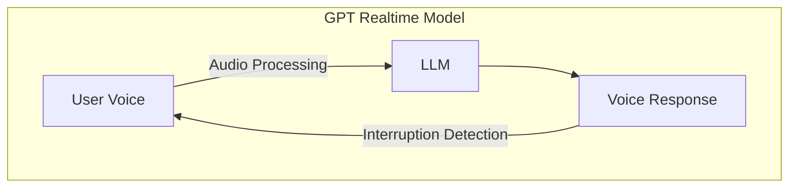
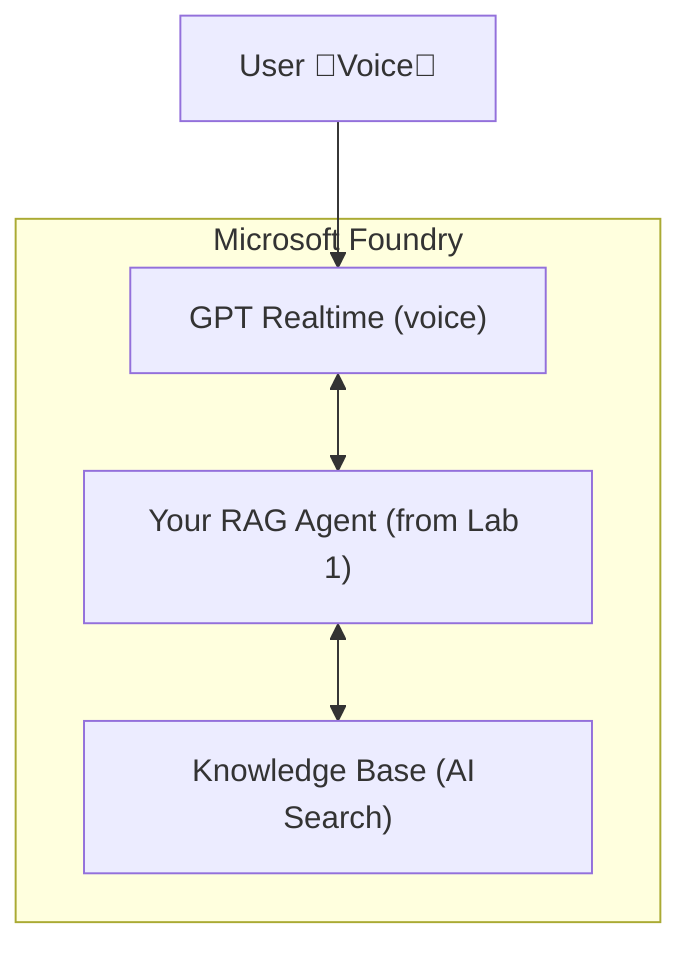

# Lab 2: Adding Voice Capabilities to Your Chatbot

[← Previous: Lab 1](../lab-1-rag-chatbot/README.md)

---

## 🎯 Lab Overview

In this lab, you'll add voice capabilities to your chatbot using the GPT Realtime API. Users will be able to have natural voice conversations with your agent - speaking directly and receiving audio responses in real-time.

**Estimated Time**: 25-35 minutes

**Prerequisites**: Completion of Lab 1 (including Sub-Lab 1.5 for the code path)

---

## 🛤️ Choose Your Path

| Path | Description | Best For |
|------|-------------|----------|
| **🖥️ Portal Path** | Deploy model via Foundry portal | Sub-Lab 2.1 only |
| **💻 Code Path** | Integrate voice into your web app | Full voice integration |

> [!NOTE]
> Sub-Lab 2.2 (voice integration) is **Code only** and builds on the Foundry Agent Web App from Sub-Lab 1.5.

---

## 📖 What You'll Learn

- **GPT Realtime API**: Low-latency "speech in, speech out" conversations
- **WebSocket Integration**: Real-time audio streaming
- **Voice Activity Detection**: Automatic speech detection settings
- **Voice Configuration**: Customizing voice, language, and behavior

---

## 🎓 Key Concepts

### What is GPT Realtime?

GPT Realtime is a model family that enables natural voice conversations:
- **Speech-to-Speech**: Direct audio input and output (no separate STT/TTS)
- **Low Latency**: Real-time responses for natural conversation flow
- **Interruption Handling**: Users can interrupt the model mid-response
- **Voice Selection**: Multiple natural-sounding voices available

### How It Works

Unlike traditional pipelines (STT → LLM → TTS), GPT Realtime handles everything in one model, reducing latency and enabling more natural conversations.

### Supported Models

| Model | Description |
|-------|-------------|
| `gpt-realtime` | Full-featured realtime audio model |
| `gpt-realtime-mini` | Smaller, faster variant |
| `gpt-realtime-preview` | Preview version with latest features |

### Voice Options

GPT Realtime supports multiple voices:
- **alloy** - Neutral and balanced
- **echo** - Warm and conversational  
- **shimmer** - Clear and expressive
- **ash** - Calm and professional
- **ballad** - Engaging storyteller
- **coral** - Friendly and approachable
- **sage** - Wise and thoughtful
- **verse** - Dynamic and energetic

---

## 🏗️ Architecture Overview

### Voice-Enabled Architecture

### Microsoft Services Used

| Component | Service | Purpose |
|-----------|---------|---------|
| **Voice Model** | GPT Realtime | Real-time speech-to-speech conversations |
| **AI Platform** | Microsoft Foundry | Unified platform for deployment |
| **Knowledge Base** | From Lab 1 | Your existing RAG agent and AI Search index |

---

## 📋 Sub-Labs

| Sub-Lab | Time | Portal | Code |
|---------|------|:------:|:----:|
| [2.1 Deploy GPT Realtime Model](./sub-lab-2.1-deploy-realtime-model.md) | 10-15 min | ✅ | ✅ |
| [2.2 Add Voice to Your Agent](./sub-lab-2.2-add-voice-to-agent.md) | 15-20 min | ❌ | ✅ |
| [2.3 Cleanup Resources](./sub-lab-2.3-cleanup.md) | 5-10 min | ✅ | ✅ |

---

##  Additional Resources

- [GPT Realtime API Documentation](https://learn.microsoft.com/en-us/azure/ai-foundry/openai/realtime-audio-quickstart)
- [WebRTC Integration Guide](https://learn.microsoft.com/en-us/azure/ai-foundry/openai/how-to/realtime-audio-webrtc)
- [Voice Options Reference](https://learn.microsoft.com/en-us/azure/ai-foundry/openai/realtime-audio-reference)

---

[← Previous: Lab 1](../lab-1-rag-chatbot/README.md)
