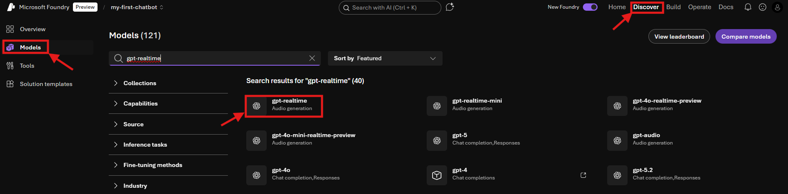
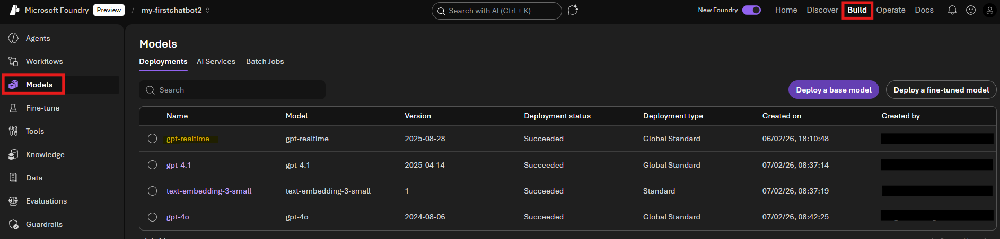

# Sub-Lab 2.1: Deploy GPT Realtime Model

[← Back to Lab 2 Overview](./README.md) | [Next: Sub-Lab 2.2 →](./sub-lab-2.2-audio-playground.md)

---

**⏱️ Estimated Time**: 10-15 minutes

## Overview

In this sub-lab, you'll deploy the GPT Realtime model in Microsoft Foundry. This model enables real-time voice conversations with low latency - users speak directly to the model and receive audio responses.

---

## 🎓 Key Concepts

### What is GPT Realtime?

GPT Realtime is a speech-to-speech (S2S) model that went **Generally Available in August 2025**. Unlike traditional voice assistants that chain separate Speech-to-Text, LLM, and Text-to-Speech services together, GPT Realtime handles everything in a single model.

| Traditional Approach | GPT Realtime |
|---------------------|--------------|
| STT → LLM → TTS (3 separate steps) | Single model handles everything |
| Higher latency (cumulative delays) | Low latency (~200-500ms) |
| No interruption handling | Natural interruptions supported |
| Separate voice configuration | Integrated voice selection |

### Key Features (GA Release)

- **New Natural Voices**: Two new voices (Marin and Cedar) with improved naturalness and clarity
- **Improved Instruction Following**: Enhanced ability to follow tone, pacing, and language instructions
- **Higher Audio Quality**: Glitch-free output with improved alphanumeric reproduction
- **Image Input Support**: Add images to context and discuss them via voice
- **Improved Function Calling**: Enhanced ability to call custom code, with async function calling support
- **Conversation Mode**: Real-world turn-taking behavior for natural phone-like interactions

### Model Variants

| Model | Best For | Notes |
|-------|----------|-------|
| `gpt-realtime` | Production voice applications | Full-featured GA model |
| `gpt-realtime-mini` | Cost-effective, faster responses | Feature parity with full model |
| `gpt-4o-realtime-preview` | Testing preview features | Use GA models for production |

### Pricing

GPT Realtime pricing is **20% lower** than the previous gpt-4o-realtime preview. Pricing is based on tokens per million:
- Text input/output tokens
- Audio input/output tokens (audio is tokenized)

---

## 🖥️ Option: Console

<details>
<summary><strong>Click to expand Console instructions</strong></summary>

### 1. Navigate to Foundry Portal

1. Go to [Microsoft Foundry](https://ai.azure.com)
2. Select your project (`my-first-chatbot`)

### 2. Deploy GPT Realtime Model

1. In the top menu go to "Discover"
2. Click "Models"on the left
3. Search for `gpt-realtime` and click on it. 
   

4. Click Deploy -> Default settings
5. Choose one of the available regions (e.g. East US 2) 
6. Pick your project. Click "Continue"


### 3. Verify Deployment

1. Wait for deployment to complete (1-2 minutes)
2. Once deployed, you'll see it in your model deployments list under Build -> Models
3. Note the deployment name - you'll need it for the Audio Playground

   

### ✅ Console Checkpoint

You should now have:
- [ ] GPT Realtime model deployed in your Foundry project
- [ ] Deployment name noted for next steps

</details>

---

## 💻 Option: Code - TO DO

<details>
<summary><strong>Click to expand Code instructions</strong></summary>

### 1. Deploy via Azure CLI

```bash
# Login to Azure (if not already)
az login

# Deploy GPT Realtime model
az cognitiveservices account deployment create \
  --name foundry-workshop-[yourname] \
  --resource-group rg-foundry-chatbot-workshop \
  --deployment-name gpt-realtime \
  --model-name gpt-realtime \
  --model-version "2025-08-28" \
  --model-format OpenAI \
  --sku-capacity 1 \
  --sku-name GlobalStandard
```

### 2. Verify Deployment

```bash
# List deployments
az cognitiveservices account deployment list \
  --name foundry-workshop-[yourname] \
  --resource-group rg-foundry-chatbot-workshop \
  --output table
```

**Expected Output:**
```
Name          Model              Version      ProvisioningState
------------  -----------------  -----------  ------------------
gpt-4o        gpt-4o             2024-05-13   Succeeded
gpt-realtime  gpt-realtime       2025-08-28   Succeeded
...
```

### 3. Update Environment Variables

Add to your `.env` file:

```properties
# GPT Realtime Configuration
AZURE_OPENAI_REALTIME_DEPLOYMENT=gpt-realtime
AZURE_OPENAI_REALTIME_VOICE=alloy
```

### ✅ Code Checkpoint

You should now have:
- [ ] GPT Realtime model deployed via CLI
- [ ] Deployment verified in the list
- [ ] `.env` updated with realtime configuration

</details>

---

[← Back to Lab 2 Overview](./README.md) | [Next: Sub-Lab 2.2 →](./sub-lab-2.2-audio-playground.md)
