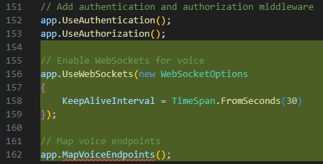
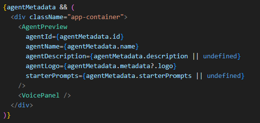
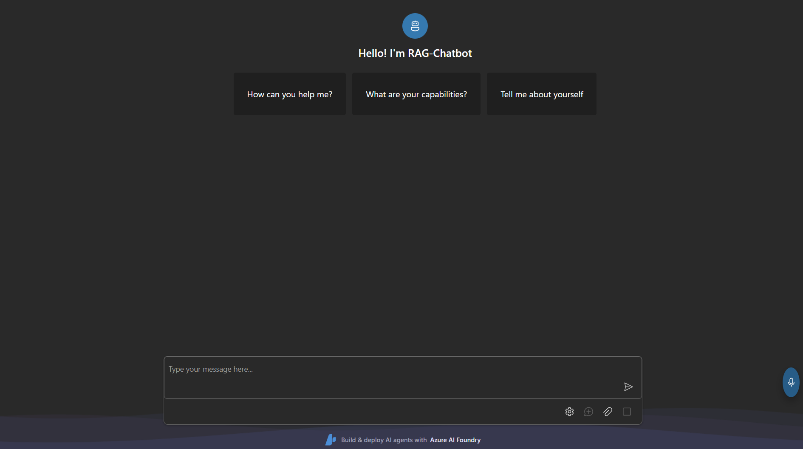
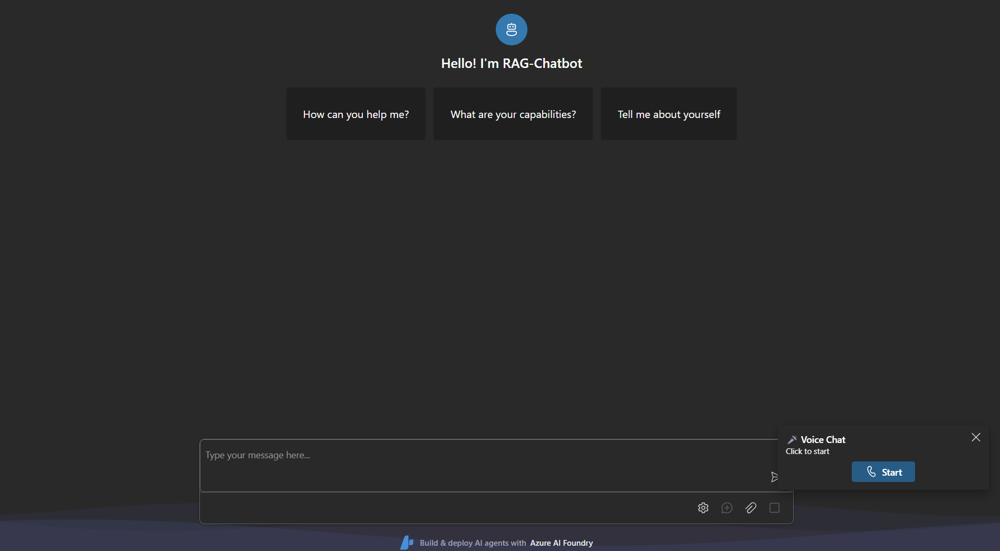
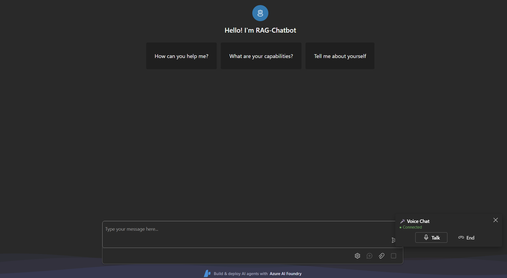
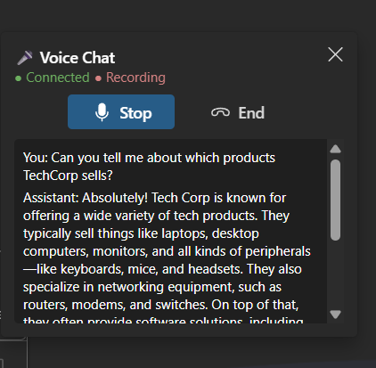

[← Back to Lab 2 Overview](./README.md) | [← Previous: Sub-Lab 2.1](./sub-lab-2.1-deploy-realtime-model.md) | [Next: Sub-Lab 2.3 →](./sub-lab-2.3-cleanup.md)

---

**⏱️ Estimated Time**: 30-40 minutes

## Overview

In this sub-lab, you'll add real-time voice capabilities to the Foundry Agent Web App you deployed in Sub-Lab 1.5. Users will be able to speak directly to your chatbot and receive spoken responses using the GPT Realtime model.

> **Note**: This sub-lab is **Code only** and builds on the Foundry Agent Web App from Sub-Lab 1.5.

---

## 🎓 Key Concepts

### Voice-Enabled Architecture with Agent Integration

The voice bot integrates GPT Realtime with your RAG agent from Lab 1 via **function calling**. When users ask questions, GPT Realtime calls the agent, which queries your knowledge base and returns grounded answers:

```
┌────────────────────────────────────────────────────────────────────┐
│                     Foundry Agent Web App                          │
│  ┌──────────────────────────────────────────────────────────────┐  │
│  │  React Frontend                                              │  │
│  │  ┌───────────────────┐      ┌────────────────────────────┐   │  │
│  │  │  VoicePanel.tsx   │ ───> │  WebSocket Connection      │   │  │
│  │  │  - Mic capture    │      │                            │   │  │
│  │  │  - Audio playback │ <─── │                            │   │  │
│  │  └───────────────────┘      └────────────────────────────┘   │  │
│  └──────────────────────────────────────────────────────────────┘  │
│  ┌──────────────────────────────────────────────────────────────┐  │
│  │  ASP.NET Core Backend (VoiceEndpoints.cs)                    │  │
│  │  ┌────────────────────────────────────────────────────────┐  │  │
│  │  │  1. Connects to GPT Realtime with agent tool configured│  │  │
│  │  │  2. Intercepts function calls from GPT Realtime        │  │  │
│  │  │  3. Calls the RAG Agent with user's question           │  │  │
│  │  │  4. Returns agent response → GPT generates spoken reply│  │  │
│  │  └────────────────────────────────────────────────────────┘  │  │
│  └──────────────────────────────────────────────────────────────┘  │
└────────────────────────────────────────────────────────────────────┘
          │                                      │
          ▼                                      ▼
┌─────────────────────────┐        ┌─────────────────────────────┐
│  Azure OpenAI Realtime  │        │     RAG Agent (Lab 1)       │
│  ┌───────────────────┐  │        │  ┌───────────────────────┐  │
│  │ gpt-realtime      │  │  ask   │  │ Foundry IQ Agent      │  │
│  │ - Speech-to-Speech│  │ ─────> │  │ - Knowledge base      │  │
│  │ - Function Calling│  │        │  │ - Azure AI Search     │  │
│  └───────────────────┘  │ <───── │  │ - Grounded answers    │  │
│                         │ answer │  └───────────────────────┘  │
└─────────────────────────┘        └─────────────────────────────┘

```

**Flow when user asks a question:**
1. User speaks → Audio sent to GPT Realtime
2. GPT Realtime transcribes and decides to call `ask_agent`
3. Backend intercepts function call, sends HTTP request to the RAG Agent from Lab 1
4. Agent queries knowledge base (Azure AI Search), returns grounded answer
5. GPT Realtime receives answer and speaks it to the user

### GPT Realtime vs Traditional Voice Pipeline

| Traditional Approach | GPT Realtime |
|---------------------|--------------|
| STT → LLM → TTS (3 services) | Single model handles everything |
| Higher latency (cumulative) | Low latency (~200-500ms) |
| No interruption handling | Natural interruptions supported |
| Separate voice config | Integrated voice selection |

### Voice Input Modes (Turn Detection)

| Mode | Description | Use Case |
|------|-------------|----------|
| **server_vad** | Server detects speech end based on silence | Natural conversations (recommended) |
| **semantic_vad** | Server detects speech end based on meaning | More natural turn-taking |
| **none** | Manual control (push-to-talk) | Noisy environments |

> 💡 **Important**: When using `server_vad` or `semantic_vad`, the server automatically detects when you stop speaking and triggers a response. You don't need to manually commit the audio buffer - the server handles this for you.

### Available Voices

| Voice | Description |
|-------|-------------|
| **alloy** | Neutral, balanced |
| **ash** | Warm tone |
| **coral** | Conversational |
| **echo** | Clear, direct |
| **sage** | Calm, thoughtful |
| **shimmer** | Soft, gentle (recommended) |

---

## 📋 Prerequisites

> 📝 **First time using the Code option?** Make sure you've completed the [Setup Guide](../SETUP.md) before continuing.

- ✅ Completed [Sub-Lab 1.5](../lab-1-rag-chatbot/sub-lab-1.5-host-agent-webapp.md) - Foundry Agent Web App deployed
- ✅ Completed [Sub-Lab 2.1](./sub-lab-2.1-deploy-realtime-model.md) - GPT Realtime model deployed
- ✅ Your webapp folder from Sub-Lab 1.5

---

## 💻 Code Instructions

### Step 1: Navigate to Your Web App

Navigate to the webapp folder you created in Sub-Lab 1.5:

```powershell
cd lab-1-rag-chatbot/webapp
```

---

### Step 2: Configure Realtime Model Settings

Add the GPT Realtime configuration to your existing `.env` file in the `lab-1-rag-chatbot` folder. Open the file and add these lines at the end:

```properties
# GPT Realtime Configuration (for Lab 2)
AZURE_OPENAI_REALTIME_DEPLOYMENT=gpt-realtime
AZURE_OPENAI_REALTIME_VOICE=shimmer  # Options: alloy, ash, coral, echo, sage, shimmer
```

> ✅ **What you're adding:**
> - **AZURE_OPENAI_REALTIME_DEPLOYMENT**: The name of your realtime model deployment (from Sub-Lab 2.1)
> - **AZURE_OPENAI_REALTIME_VOICE**: The voice to use for responses (shimmer is a soft, gentle voice)
>
> **Required from Lab 1 (should already be in your .env):**
> - `AZURE_OPENAI_ENDPOINT` - Used by the backend to connect to GPT Realtime
> - `AI_AGENT_ENDPOINT` - The RAG agent endpoint from Sub-Lab 1.4/1.5

---

### Step 3: Add Backend Voice Endpoint with Agent Integration

This is the key component that connects GPT Realtime to your RAG agent from Lab 1. Instead of just relaying messages, it:
1. Configures GPT Realtime with an `ask_agent` tool
2. Intercepts function call requests from GPT Realtime
3. Calls the RAG Agent via `AgentFrameworkService` (the same service used by the chat endpoint)
4. Returns the agent's response so GPT Realtime can speak the answer

Create a new folder and file in the `lab-1-rag-chatbot/webapp/backend/WebApp.Api` folder.
Create a folder named `Endpoints` and a file `VoiceEndpoints.cs` inside that folder:

```csharp
using System.Net.WebSockets;
using System.Text;
using System.Text.Json;
using System.Text.Json.Nodes;
using Azure.Identity;
using WebApp.Api.Services;

namespace WebApp.Api.Endpoints;

public static class VoiceEndpoints
{
    public static void MapVoiceEndpoints(this WebApplication app)
    {
        app.Map("/api/voice/realtime", async (HttpContext context) =>
        {
            if (!context.WebSockets.IsWebSocketRequest)
            {
                context.Response.StatusCode = StatusCodes.Status400BadRequest;
                await context.Response.WriteAsync("WebSocket connection required");
                return;
            }

            // Resolve the AgentFrameworkService from DI to call the RAG agent properly
            var agentService = context.RequestServices.GetRequiredService<AgentFrameworkService>();

            using var clientSocket = await context.WebSockets.AcceptWebSocketAsync();
            await HandleRealtimeSession(clientSocket, agentService, context.RequestAborted);
        });
    }

    private static async Task HandleRealtimeSession(
        WebSocket clientSocket,
        AgentFrameworkService agentService,
        CancellationToken cancellationToken)
    {
        // Get configuration
        var endpoint = Environment.GetEnvironmentVariable("AZURE_OPENAI_ENDPOINT")
            ?? throw new InvalidOperationException("AZURE_OPENAI_ENDPOINT not configured");
        var deployment = Environment.GetEnvironmentVariable("AZURE_OPENAI_REALTIME_DEPLOYMENT")
            ?? "gpt-realtime";
        var voice = Environment.GetEnvironmentVariable("AZURE_OPENAI_REALTIME_VOICE")
            ?? "shimmer";
        var apiVersion = "2025-04-01-preview";

        // Get authentication token for Azure OpenAI
        var credential = new DefaultAzureCredential();
        var tokenResult = await credential.GetTokenAsync(
            new Azure.Core.TokenRequestContext(["https://cognitiveservices.azure.com/.default"]),
            cancellationToken);

        // Connect to Azure OpenAI Realtime API
        var wsEndpoint = endpoint.Replace("https://", "wss://");
        var realtimeUrl = $"{wsEndpoint}/openai/realtime?api-version={apiVersion}&deployment={deployment}";

        using var realtimeSocket = new ClientWebSocket();
        realtimeSocket.Options.SetRequestHeader("Authorization", $"Bearer {tokenResult.Token}");

        try
        {
            await realtimeSocket.ConnectAsync(new Uri(realtimeUrl), cancellationToken);
            Console.WriteLine("Connected to Azure OpenAI Realtime API");

            // Send initial session configuration with agent tool
            await SendSessionConfig(realtimeSocket, voice, cancellationToken);

            // Handle bidirectional communication with function call interception
            await HandleBidirectionalCommunication(
                clientSocket, realtimeSocket, agentService, cancellationToken);
        }
        catch (Exception ex)
        {
            Console.WriteLine($"Realtime connection error: {ex.Message}");
            throw;
        }
    }

    private static async Task SendSessionConfig(
        WebSocket realtimeSocket,
        string voice,
        CancellationToken cancellationToken)
    {
        // Define the agent tool that GPT Realtime can call
        var sessionConfig = new
        {
            type = "session.update",
            session = new
            {
                modalities = new[] { "text", "audio" },
                voice = voice,
                input_audio_format = "pcm16",
                output_audio_format = "pcm16",
                input_audio_transcription = new { model = "whisper-1" },
                turn_detection = new
                {
                    type = "server_vad",
                    threshold = 0.5,
                    prefix_padding_ms = 300,
                    silence_duration_ms = 800
                },
                instructions = """
                    You are a helpful customer service assistant for TechCorp.
                    
                    IMPORTANT: You MUST use the ask_agent function to answer ANY question 
                    about TechCorp, its products, policies, shipping, returns, or contact information.
                    
                    Do NOT answer from your own knowledge - always ask the agent first.
                    
                    When you receive a response from the agent, speak it naturally to the user.
                    If the agent says it doesn't know something, relay that to the user politely.
                    
                    Always be polite and professional.
                    """,
                tools = new[]
                {
                    new
                    {
                        type = "function",
                        name = "ask_agent",
                        description = "Ask the TechCorp RAG agent a question. The agent has access to the knowledge base with information about products, policies, shipping, returns, support, and company information. Use this for ANY question about TechCorp.",
                        parameters = new
                        {
                            type = "object",
                            properties = new
                            {
                                question = new
                                {
                                    type = "string",
                                    description = "The question to ask the agent"
                                }
                            },
                            required = new[] { "question" }
                        }
                    }
                },
                tool_choice = "auto"
            }
        };

        var json = JsonSerializer.Serialize(sessionConfig);
        var bytes = Encoding.UTF8.GetBytes(json);
        await realtimeSocket.SendAsync(bytes, WebSocketMessageType.Text, true, cancellationToken);
        Console.WriteLine("Sent session config with agent tool");
    }

    private static async Task HandleBidirectionalCommunication(
        WebSocket clientSocket,
        WebSocket realtimeSocket,
        AgentFrameworkService agentService,
        CancellationToken cancellationToken)
    {
        var clientBuffer = new byte[16384];
        var realtimeBuffer = new byte[65536];

        // Track pending function calls
        var pendingFunctionCalls = new Dictionary<string, StringBuilder>();

        // Start both receive loops
        var clientReceiveTask = ReceiveFromClientAsync(
            clientSocket, realtimeSocket, clientBuffer, cancellationToken);
        var realtimeReceiveTask = ReceiveFromRealtimeAsync(
            realtimeSocket, clientSocket, agentService, realtimeBuffer, 
            pendingFunctionCalls, cancellationToken);

        await Task.WhenAny(clientReceiveTask, realtimeReceiveTask);
    }

    private static async Task ReceiveFromClientAsync(
        WebSocket clientSocket,
        WebSocket realtimeSocket,
        byte[] buffer,
        CancellationToken cancellationToken)
    {
        try
        {
            while (clientSocket.State == WebSocketState.Open && !cancellationToken.IsCancellationRequested)
            {
                var result = await clientSocket.ReceiveAsync(buffer, cancellationToken);

                if (result.MessageType == WebSocketMessageType.Close)
                {
                    if (realtimeSocket.State == WebSocketState.Open)
                    {
                        await realtimeSocket.CloseAsync(
                            WebSocketCloseStatus.NormalClosure, "Closing", cancellationToken);
                    }
                    break;
                }

                if (realtimeSocket.State == WebSocketState.Open)
                {
                    await realtimeSocket.SendAsync(
                        new ArraySegment<byte>(buffer, 0, result.Count),
                        result.MessageType, result.EndOfMessage, cancellationToken);
                }
            }
        }
        catch (WebSocketException) { }
    }

    private static async Task ReceiveFromRealtimeAsync(
        WebSocket realtimeSocket,
        WebSocket clientSocket,
        AgentFrameworkService agentService,
        byte[] buffer,
        Dictionary<string, StringBuilder> pendingFunctionCalls,
        CancellationToken cancellationToken)
    {
        try
        {
            while (realtimeSocket.State == WebSocketState.Open && !cancellationToken.IsCancellationRequested)
            {
                var result = await realtimeSocket.ReceiveAsync(buffer, cancellationToken);

                if (result.MessageType == WebSocketMessageType.Close)
                {
                    if (clientSocket.State == WebSocketState.Open)
                    {
                        await clientSocket.CloseAsync(
                            WebSocketCloseStatus.NormalClosure, "Closing", cancellationToken);
                    }
                    break;
                }

                // Parse the message to check for function calls
                var messageText = Encoding.UTF8.GetString(buffer, 0, result.Count);
                var handled = await TryHandleFunctionCall(
                    messageText, realtimeSocket, agentService, 
                    pendingFunctionCalls, cancellationToken);

                // Always forward the message to the client (for transcripts, audio, etc.)
                if (clientSocket.State == WebSocketState.Open)
                {
                    await clientSocket.SendAsync(
                        new ArraySegment<byte>(buffer, 0, result.Count),
                        result.MessageType, result.EndOfMessage, cancellationToken);
                }
            }
        }
        catch (WebSocketException) { }
    }

    private static async Task<bool> TryHandleFunctionCall(
        string messageText,
        WebSocket realtimeSocket,
        AgentFrameworkService agentService,
        Dictionary<string, StringBuilder> pendingFunctionCalls,
        CancellationToken cancellationToken)
    {
        try
        {
            var message = JsonNode.Parse(messageText);
            var messageType = message?["type"]?.GetValue<string>();

            // Accumulate function call arguments (they come in chunks)
            if (messageType == "response.function_call_arguments.delta")
            {
                var callId = message?["call_id"]?.GetValue<string>();
                var delta = message?["delta"]?.GetValue<string>();
                
                if (!string.IsNullOrEmpty(callId) && delta != null)
                {
                    if (!pendingFunctionCalls.ContainsKey(callId))
                    {
                        pendingFunctionCalls[callId] = new StringBuilder();
                    }
                    pendingFunctionCalls[callId].Append(delta);
                }
            }
            // Function call is complete - execute it
            else if (messageType == "response.function_call_arguments.done")
            {
                var callId = message?["call_id"]?.GetValue<string>();
                var functionName = message?["name"]?.GetValue<string>();
                
                if (!string.IsNullOrEmpty(callId) && functionName == "ask_agent")
                {
                    var argumentsJson = pendingFunctionCalls.GetValueOrDefault(callId)?.ToString() 
                        ?? message?["arguments"]?.GetValue<string>() ?? "{}";
                    
                    Console.WriteLine($"Function call: {functionName}({argumentsJson})");

                    // Parse the question from arguments
                    var args = JsonNode.Parse(argumentsJson);
                    var question = args?["question"]?.GetValue<string>() ?? "";

                    // Call the RAG Agent via AgentFrameworkService (same as chat endpoint)
                    var agentResponse = await CallAgent(agentService, question, cancellationToken);
                    Console.WriteLine($"Agent response received: {agentResponse.Length} chars");

                    // Send function result back to GPT Realtime
                    await SendFunctionResult(realtimeSocket, callId, agentResponse, cancellationToken);

                    // Clean up
                    pendingFunctionCalls.Remove(callId);
                    return true;
                }
            }
        }
        catch (JsonException ex)
        {
            Console.WriteLine($"JSON parse error: {ex.Message}");
        }

        return false;
    }

    private static async Task<string> CallAgent(
        AgentFrameworkService agentService,
        string question,
        CancellationToken cancellationToken)
    {
        try
        {
            Console.WriteLine($"Calling RAG agent with question: {question}");

            // Create a new conversation for this voice query
            var conversationId = await agentService.CreateConversationAsync(question, cancellationToken);

            // Stream the agent response and collect the full text
            var responseBuilder = new StringBuilder();
            await foreach (var chunk in agentService.StreamMessageAsync(
                conversationId,
                question,
                cancellationToken: cancellationToken))
            {
                if (chunk.IsText && chunk.TextDelta != null)
                {
                    responseBuilder.Append(chunk.TextDelta);
                }
            }

            var agentResponse = responseBuilder.ToString();
            Console.WriteLine($"Agent response: {agentResponse.Length} chars");

            if (string.IsNullOrWhiteSpace(agentResponse))
            {
                return "I'm sorry, I didn't get a response from the knowledge base. Please try again.";
            }

            return agentResponse;
        }
        catch (Exception ex)
        {
            Console.WriteLine($"Agent call error: {ex.Message}");
            return "I'm sorry, I couldn't connect to the knowledge base. Please try again.";
        }
    }

    private static async Task SendFunctionResult(
        WebSocket realtimeSocket,
        string callId,
        string agentResponse,
        CancellationToken cancellationToken)
    {
        // Send the function output as a conversation item
        var functionOutput = new
        {
            type = "conversation.item.create",
            item = new
            {
                type = "function_call_output",
                call_id = callId,
                output = agentResponse
            }
        };

        var json = JsonSerializer.Serialize(functionOutput);
        var bytes = Encoding.UTF8.GetBytes(json);
        await realtimeSocket.SendAsync(bytes, WebSocketMessageType.Text, true, cancellationToken);
        Console.WriteLine("Sent agent response to GPT Realtime");

        // Trigger response generation
        var createResponse = new { type = "response.create" };
        json = JsonSerializer.Serialize(createResponse);
        bytes = Encoding.UTF8.GetBytes(json);
        await realtimeSocket.SendAsync(bytes, WebSocketMessageType.Text, true, cancellationToken);
    }
}
```

> 📖 **What this code does:**
> 1. **Configures Agent Tool**: When the session starts, it tells GPT Realtime about the `ask_agent` function
> 2. **Intercepts Function Calls**: Watches for function call events from GPT Realtime
> 3. **Calls Your RAG Agent**: Uses `AgentFrameworkService` (the same service the chat endpoint uses) to query your Lab 1 agent with proper authentication
> 4. **Returns Grounded Responses**: Sends the agent's answer back so GPT Realtime can speak it to the user
---

### Step 4: Register Voice Endpoints and WebSockets

Update the existing file `backend/WebApp.Api/Program.cs` to enable WebSockets and register the voice endpoints.

**First, add the using statement at the top of the file (with the other using statements):**

```csharp
using WebApp.Api.Endpoints;
```

**Then, after `app.UseAuthorization()`, around line 154, add:**

```csharp
// Enable WebSockets for voice
app.UseWebSockets(new WebSocketOptions
{
    KeepAliveInterval = TimeSpan.FromSeconds(30)
});

// Map voice endpoints
app.MapVoiceEndpoints();
```
   


### Step 5: Create Frontend Audio Utilities

Create a new file `frontend/src/utils/audioUtils.ts` to handle PCM16 audio conversion:

```typescript
/**
 * Audio utilities for GPT Realtime API integration
 * The Realtime API expects PCM16 audio at 24kHz sample rate
 */

const SAMPLE_RATE = 24000;

/**
 * Creates an AudioContext configured for the Realtime API
 */
export function createAudioContext(): AudioContext {
  return new AudioContext({ sampleRate: SAMPLE_RATE });
}

/**
 * Converts a Float32Array to base64-encoded PCM16
 */
export function floatTo16BitPCM(float32Array: Float32Array): ArrayBuffer {
  const buffer = new ArrayBuffer(float32Array.length * 2);
  const view = new DataView(buffer);
  
  for (let i = 0; i < float32Array.length; i++) {
    const s = Math.max(-1, Math.min(1, float32Array[i]));
    view.setInt16(i * 2, s < 0 ? s * 0x8000 : s * 0x7fff, true);
  }
  
  return buffer;
}

/**
 * Converts base64-encoded PCM16 to Float32Array for playback
 */
export function base64ToFloat32Array(base64: string): Float32Array {
  const binaryString = atob(base64);
  const bytes = new Uint8Array(binaryString.length);
  
  for (let i = 0; i < binaryString.length; i++) {
    bytes[i] = binaryString.charCodeAt(i);
  }
  
  const int16Array = new Int16Array(bytes.buffer);
  const float32Array = new Float32Array(int16Array.length);
  
  for (let i = 0; i < int16Array.length; i++) {
    float32Array[i] = int16Array[i] / 0x8000;
  }
  
  return float32Array;
}

/**
 * Converts an ArrayBuffer to base64 string
 */
export function arrayBufferToBase64(buffer: ArrayBuffer): string {
  const bytes = new Uint8Array(buffer);
  let binary = '';
  for (let i = 0; i < bytes.byteLength; i++) {
    binary += String.fromCharCode(bytes[i]);
  }
  return btoa(binary);
}

/**
 * Audio player that queues and plays PCM16 audio chunks
 */
export class AudioPlayer {
  private audioContext: AudioContext;
  private scheduledTime: number = 0;

  constructor() {
    this.audioContext = createAudioContext();
  }

  async play(base64Audio: string): Promise<void> {
    if (this.audioContext.state === 'suspended') {
      await this.audioContext.resume();
    }

    const floatData = base64ToFloat32Array(base64Audio);
    const audioBuffer = this.audioContext.createBuffer(1, floatData.length, SAMPLE_RATE);
    audioBuffer.getChannelData(0).set(floatData);

    const source = this.audioContext.createBufferSource();
    source.buffer = audioBuffer;
    source.connect(this.audioContext.destination);

    // Schedule playback
    const startTime = Math.max(this.audioContext.currentTime, this.scheduledTime);
    source.start(startTime);
    this.scheduledTime = startTime + audioBuffer.duration;
  }

  stop(): void {
    this.scheduledTime = 0;
  }

  async close(): Promise<void> {
    await this.audioContext.close();
  }
}

/**
 * Audio recorder that captures microphone input and converts to PCM16
 */
export class AudioRecorder {
  private audioContext: AudioContext | null = null;
  private mediaStream: MediaStream | null = null;
  private processor: ScriptProcessorNode | null = null;
  private onAudioData: ((base64: string) => void) | null = null;

  async start(onAudioData: (base64: string) => void): Promise<void> {
    this.onAudioData = onAudioData;

    // Get microphone access
    this.mediaStream = await navigator.mediaDevices.getUserMedia({
      audio: {
        sampleRate: SAMPLE_RATE,
        channelCount: 1,
        echoCancellation: true,
        noiseSuppression: true,
      }
    });

    this.audioContext = createAudioContext();
    const source = this.audioContext.createMediaStreamSource(this.mediaStream);

    // Create processor for capturing audio data
    // Note: ScriptProcessorNode is deprecated but widely supported
    // For production, consider AudioWorklet
    this.processor = this.audioContext.createScriptProcessor(4096, 1, 1);
    
    this.processor.onaudioprocess = (event) => {
      const inputData = event.inputBuffer.getChannelData(0);
      const pcm16 = floatTo16BitPCM(inputData);
      const base64 = arrayBufferToBase64(pcm16);
      this.onAudioData?.(base64);
    };

    source.connect(this.processor);
    this.processor.connect(this.audioContext.destination);
  }

  stop(): void {
    this.processor?.disconnect();
    this.mediaStream?.getTracks().forEach(track => track.stop());
    this.audioContext?.close();
    
    this.processor = null;
    this.mediaStream = null;
    this.audioContext = null;
    this.onAudioData = null;
  }
}
```

---

### Step 6: Create Voice Panel Component

Create a new file `frontend/src/components/VoicePanel.tsx`:

```tsx
import { useState, useRef, useCallback, useEffect } from 'react';
import {
  Button,
  Card,
  CardHeader,
  Text,
  Spinner,
  makeStyles,
  tokens,
} from '@fluentui/react-components';
import {
  Mic24Regular,
  Mic24Filled,
  Call24Regular,
  CallEnd24Regular,
  Dismiss24Regular,
} from '@fluentui/react-icons';
import { AudioPlayer, AudioRecorder } from '../utils/audioUtils';

const useStyles = makeStyles({
  // Collapsed state - just a floating button
  collapsedButton: {
    position: 'fixed',
    bottom: '100px',
    right: '20px',
    zIndex: 1000,
    borderRadius: '50%',
    width: '56px',
    height: '56px',
    boxShadow: tokens.shadow16,
  },
  // Expanded panel
  container: {
    position: 'fixed',
    bottom: '100px',
    right: '20px',
    width: '320px',
    zIndex: 1000,
    display: 'flex',
    flexDirection: 'column',
    gap: tokens.spacingVerticalS,
    padding: tokens.spacingHorizontalM,
    boxShadow: tokens.shadow16,
  },
  header: {
    display: 'flex',
    alignItems: 'center',
    justifyContent: 'space-between',
  },
  controls: {
    display: 'flex',
    gap: tokens.spacingHorizontalS,
    alignItems: 'center',
    justifyContent: 'center',
  },
  status: {
    display: 'flex',
    alignItems: 'center',
    gap: tokens.spacingHorizontalXS,
  },
  recording: {
    color: tokens.colorPaletteRedForeground1,
  },
  connected: {
    color: tokens.colorPaletteGreenForeground1,
  },
  transcript: {
    maxHeight: '150px',
    overflowY: 'auto',
    padding: tokens.spacingHorizontalS,
    backgroundColor: tokens.colorNeutralBackground2,
    borderRadius: tokens.borderRadiusMedium,
    fontSize: tokens.fontSizeBase200,
  },
  closeButton: {
    position: 'absolute',
    top: tokens.spacingVerticalS,
    right: tokens.spacingHorizontalS,
  },
});

// Realtime API message types
interface RealtimeMessage {
  type: string;
  [key: string]: unknown;
}

export const VoicePanel: React.FC = () => {
  const styles = useStyles();
  
  const [isExpanded, setIsExpanded] = useState(false);
  const [isConnected, setIsConnected] = useState(false);
  const [isConnecting, setIsConnecting] = useState(false);
  const [isRecording, setIsRecording] = useState(false);
  const [transcript, setTranscript] = useState<string[]>([]);
  const [error, setError] = useState<string | null>(null);

  const wsRef = useRef<WebSocket | null>(null);
  const audioPlayerRef = useRef<AudioPlayer | null>(null);
  const audioRecorderRef = useRef<AudioRecorder | null>(null);
  const audioSentRef = useRef<boolean>(false);

  // Connect to the voice endpoint
  const connect = useCallback(async () => {
    setIsConnecting(true);
    setError(null);

    try {
      // Determine WebSocket URL
      const protocol = window.location.protocol === 'https:' ? 'wss:' : 'ws:';
      const wsUrl = `${protocol}//${window.location.host}/api/voice/realtime`;

      const ws = new WebSocket(wsUrl);
      wsRef.current = ws;

      ws.onopen = () => {
        console.log('WebSocket connected');
        setIsConnected(true);
        setIsConnecting(false);

        // Initialize audio player
        audioPlayerRef.current = new AudioPlayer();

        // NOTE: Session configuration (including RAG tools) is handled by the backend
        // in VoiceEndpoints.cs - do NOT send session.update from frontend as it would
        // overwrite the backend's RAG configuration
        console.log('Connected - waiting for backend session config');
      };

      ws.onmessage = (event) => {
        const message: RealtimeMessage = JSON.parse(event.data);
        handleRealtimeMessage(message);
      };

      ws.onclose = () => {
        console.log('WebSocket disconnected');
        setIsConnected(false);
        setIsRecording(false);
        cleanup();
      };

      ws.onerror = (event) => {
        console.error('WebSocket error:', event);
        setError('Connection failed. Please try again.');
        setIsConnecting(false);
      };

    } catch (err) {
      console.error('Failed to connect:', err);
      setError('Failed to connect to voice service');
      setIsConnecting(false);
    }
  }, []);

  // Handle messages from Realtime API
  const handleRealtimeMessage = useCallback((message: RealtimeMessage) => {
    switch (message.type) {
      case 'session.created':
        console.log('Session created');
        break;

      case 'session.updated':
        console.log('Session updated');
        break;

      case 'conversation.item.input_audio_transcription.completed':
        // User's speech was transcribed
        const userText = message.transcript as string;
        if (userText) {
          setTranscript(prev => [...prev, `You: ${userText}`]);
        }
        break;

      case 'response.audio_transcript.delta':
        // Streaming assistant text (for display)
        break;

      case 'response.audio_transcript.done':
        // Final assistant transcript
        const assistantText = message.transcript as string;
        if (assistantText) {
          setTranscript(prev => [...prev, `Assistant: ${assistantText}`]);
        }
        break;

      case 'response.audio.delta':
        // Audio chunk from assistant - play it
        const audioData = message.delta as string;
        if (audioData && audioPlayerRef.current) {
          audioPlayerRef.current.play(audioData);
        }
        break;

      case 'response.audio.done':
        console.log('Audio response complete');
        break;

      case 'error':
        console.error('Realtime API error:', message);
        const errorMsg = (message.error as { message?: string })?.message || 'An error occurred';
        // Don't show buffer errors to user - server_vad handles these automatically
        if (!errorMsg.includes('buffer')) {
          setError(errorMsg);
        }
        break;

      default:
        // Log other message types for debugging
        if (message.type.startsWith('error')) {
          console.error('Error message:', message);
        }
    }
  }, []);

  // Start recording
  const startRecording = useCallback(async () => {
    if (!wsRef.current || wsRef.current.readyState !== WebSocket.OPEN) {
      setError('Not connected');
      return;
    }

    try {
      audioRecorderRef.current = new AudioRecorder();
      audioSentRef.current = false;
      
      await audioRecorderRef.current.start((base64Audio: string) => {
        // Send audio to Realtime API
        if (wsRef.current?.readyState === WebSocket.OPEN) {
          wsRef.current.send(JSON.stringify({
            type: 'input_audio_buffer.append',
            audio: base64Audio,
          }));
          audioSentRef.current = true;
        }
      });

      setIsRecording(true);
      setError(null);
    } catch (err) {
      console.error('Failed to start recording:', err);
      setError('Failed to access microphone. Please check permissions.');
    }
  }, []);

  // Stop recording
  const stopRecording = useCallback(() => {
    audioRecorderRef.current?.stop();
    audioRecorderRef.current = null;
    setIsRecording(false);
    // Note: With server_vad enabled, the server automatically detects speech end
    // and triggers a response. No manual commit needed.
    audioSentRef.current = false;
  }, []);

  // Disconnect
  const disconnect = useCallback(() => {
    cleanup();
    wsRef.current?.close();
    wsRef.current = null;
    setIsConnected(false);
    setIsRecording(false);
  }, []);

  // Cleanup resources
  const cleanup = useCallback(() => {
    audioRecorderRef.current?.stop();
    audioRecorderRef.current = null;
    audioPlayerRef.current?.stop();
    audioPlayerRef.current?.close();
    audioPlayerRef.current = null;
  }, []);

  // Cleanup on unmount
  useEffect(() => {
    return () => {
      cleanup();
      wsRef.current?.close();
    };
  }, [cleanup]);

  // Collapsed state - just a floating mic button
  if (!isExpanded) {
    return (
      <Button
        className={styles.collapsedButton}
        appearance="primary"
        icon={<Mic24Regular />}
        onClick={() => setIsExpanded(true)}
        title="Open Voice Chat"
      />
    );
  }

  // Expanded state - full panel
  return (
    <Card className={styles.container}>
      <Button
        className={styles.closeButton}
        appearance="subtle"
        icon={<Dismiss24Regular />}
        size="small"
        onClick={() => {
          if (!isRecording) {
            setIsExpanded(false);
          }
        }}
        title="Minimize"
      />
      
      <CardHeader
        header={<Text weight="semibold">🎤 Voice Chat</Text>}
        description={
          <div className={styles.status}>
            {isConnected ? (
              <Text size={200} className={styles.connected}>● Connected</Text>
            ) : isConnecting ? (
              <Text size={200}>Connecting...</Text>
            ) : (
              <Text size={200}>Click to start</Text>
            )}
            {isRecording && (
              <Text size={200} className={styles.recording}> ● Recording</Text>
            )}
          </div>
        }
      />

      <div className={styles.controls}>
        {!isConnected ? (
          <Button
            appearance="primary"
            icon={isConnecting ? <Spinner size="tiny" /> : <Call24Regular />}
            onClick={connect}
            disabled={isConnecting}
          >
            {isConnecting ? 'Connecting...' : 'Start'}
          </Button>
        ) : (
          <>
            <Button
              appearance={isRecording ? 'primary' : 'secondary'}
              icon={isRecording ? <Mic24Filled /> : <Mic24Regular />}
              onClick={isRecording ? stopRecording : startRecording}
            >
              {isRecording ? 'Stop' : 'Talk'}
            </Button>
            <Button
              appearance="subtle"
              icon={<CallEnd24Regular />}
              onClick={disconnect}
            >
              End
            </Button>
          </>
        )}
      </div>

      {error && (
        <Text size={200} style={{ color: tokens.colorPaletteRedForeground1 }}>
          {error}
        </Text>
      )}

      {transcript.length > 0 && (
        <div className={styles.transcript}>
          {transcript.slice(-3).map((line, i) => (
            <Text key={i} block size={200} style={{ marginBottom: '4px' }}>
              {line}
            </Text>
          ))}
        </div>
      )}
    </Card>
  );
};
```

> **Note**: The VoicePanel displays as a collapsible floating button in the bottom-right corner. Click the mic button to expand it, then click "Start" to connect. Once connected, click "Talk" and speak - the server will automatically detect when you're done and respond with audio. The panel shows only the last 3 transcript lines for a cleaner UI.

---

### Step 7: Add Voice Panel to the App

Update `frontend/src/App.tsx` to include the VoicePanel. Find the main layout section and add the VoicePanel component.

First, add the import at the top:

```tsx
import { VoicePanel } from './components/VoicePanel';
```

Then add the component to your layout. The exact location depends on your UI preference, but a common approach is to add it alongside or below the chat interface. (E.g. on line 96 just after the agent preview)

```tsx
{/* Add Voice Panel */}
<VoicePanel />
```
   

---

### Step 8: Update Infrastructure for Voice Environment Variables

The voice endpoint needs environment variables to connect to the Realtime API. Update your Bicep files to pass these values.

> 💡 **Note**: The voice backend calls your RAG Agent (via `AI_AGENT_ENDPOINT`, already configured in Lab 1), which handles all knowledge base queries. You only need to add the Realtime API configuration.

**8a. Update `infra/main.bicep`**

Add the new parameter near the existing parameters (around line 20-30):

```bicep
@description('Azure OpenAI endpoint for Realtime API')
param azureOpenAiEndpoint string = ''
```

Then, in the same file in the module call to `main-app.bicep` (around line 75), add the parameter:

```bicep
module app 'main-app.bicep' = {
  name: 'app'
  params: {
    // ... existing params ...
    azureOpenAiEndpoint: azureOpenAiEndpoint
  }
}
```

**8b. Update `infra/main-app.bicep`**

Add the parameter at the top:

```bicep
@description('Azure OpenAI endpoint for Realtime API')
param azureOpenAiEndpoint string = ''
```

Then find the `env: [...]` array inside the `webApp` module (around line 28-52) and add these environment variables at the end of the array, before the closing `]`:

```bicep
    env: [
      // ... existing env vars like ASPNETCORE_ENVIRONMENT, AI_AGENT_ENDPOINT, etc. ...
      {
        name: 'AZURE_OPENAI_ENDPOINT'
        value: azureOpenAiEndpoint
      }
      {
        name: 'AZURE_OPENAI_REALTIME_DEPLOYMENT'
        value: 'gpt-realtime'
      }
      {
        name: 'AZURE_OPENAI_REALTIME_VOICE'
        value: 'shimmer'
      }
    ]
```

**8c. Update `infra/main.parameters.json`**

Add the mapping so azd passes the environment variable to Bicep. Find the `parameters` section and add:

```json
"azureOpenAiEndpoint": {
  "value": "${AZURE_OPENAI_ENDPOINT=}"
}
```

**8d. Set the endpoint value in azd environment**

> ✏️ **Replace [yourname]** with the same value you used in sub-lab 1.1.

```powershell
azd env set AZURE_OPENAI_ENDPOINT "https://foundry-workshop-[yourname].cognitiveservices.azure.com/"
```

> ⚠️ **Important**: The `.env` file is for local development only. When deploying to Azure Container Apps, environment variables must be set via `azd env set` so they're passed through the Bicep templates.

---

### Step 9: Verify WebSocket Configuration

Azure Container Apps supports WebSockets by default. Verify your configuration is correct:

1. Open `container-app.bicep` in the `webapp/infra/core/host` folder
2. Find the ingress configuration (around line 27) and confirm it looks like this:

```bicep
ingress: enableIngress ? {
  external: external
  targetPort: targetPort
  transport: 'auto'  // 'auto' or 'http' both support WebSockets
  allowInsecure: false
} : null
```

> 💡 **Note**: The default template already has `transport: 'auto'` which supports WebSockets. If your configuration matches the above, no changes are needed.

---

### Step 10: Deploy to Azure

Deploy your updated app with voice capabilities. Use `azd up` (not `azd deploy`) to update both the infrastructure (environment variables) and the application code:

```powershell
azd up
```

> ⚠️ **Important**: `azd deploy` only updates the container image. To apply new environment variables from the Bicep templates, you must run `azd up` which provisions infrastructure AND deploys the app.


**Get your deployed URL:**

If your browser didn't open automatically, you can get the URL with:

```powershell
azd env get-values | Select-String "WEB_ENDPOINT"
```

**Test voice chat:**

1. Open the URL in your browser
2. Sign in with your Microsoft account. You should see the screen below

3. Click the Microphone button on the bottom right.

    

4. Click **"Start"** to connect

    

4. Click **"Talk"** and ask a question about your knowledge base

    

5. Release to let the server detect end of speech

    

6. Listen to the spoken response!

**Try these questions:**
- "What products does TechCorp offer?"
- "What is the return policy?"
- "How do I contact support?"

---

## 🔧 Troubleshooting

### "WebSocket connection failed"

1. Check that WebSockets are enabled on your Container App
2. Verify the `AZURE_OPENAI_ENDPOINT` is set correctly (it should be the base URL like `https://your-resource.cognitiveservices.azure.com`)
3. Check that the managed identity has access to Azure OpenAI

### "I couldn't reach the knowledge base" / Agent connection errors

1. Verify the `AI_AGENT_ENDPOINT` is set correctly in your environment
2. Check that the agent from Lab 1 is still running (test it in the Azure AI Foundry playground)
3. Look at the container app logs for more detailed error messages:
   ```powershell
   az containerapp logs show --name <your-app-name> --resource-group <your-rg> --follow
   ```

### "Buffer too small" errors in console

This error can be safely ignored when using `server_vad` mode. The server automatically handles turn detection and may occasionally report this when you pause briefly. The code already filters these errors from the UI.

### "Failed to access microphone"

1. Ensure your site is served over HTTPS (required for microphone access)
2. Check browser permissions for microphone access
3. Try a different browser if issues persist

### No audio playback

1. Check browser console for errors
2. Ensure the AudioContext is not suspended (requires user interaction)
3. Verify the `output_audio_format` matches what the player expects

### High latency

1. Consider using `semantic_vad` for more natural turn detection
2. Reduce `silence_duration_ms` in the session config
3. Check network latency to your Azure region

---

## ✅ Validation Checklist

| Check | Status |
|-------|--------|
| VoiceEndpoints.cs created with agent integration | ⬜ |
| WebSockets enabled in Program.cs | ⬜ |
| audioUtils.ts created | ⬜ |
| VoicePanel.tsx created | ⬜ |
| VoicePanel added to App | ⬜ |
| Infrastructure bicep updated (OpenAI Realtime) | ⬜ |
| Environment variables configured | ⬜ |
| Can speak and be understood | ⬜ |
| Voice bot queries RAG Agent from Lab 1 | ⬜ |
| Receives spoken responses with knowledge base context | ⬜ |
| Deployed to Azure successfully | ⬜ |

---

## 🎉 Congratulations!

You've successfully added voice capabilities to your chatbot! Your voice bot now:

- 🎤 Listens to natural speech input
- 🤖 Calls your RAG Agent from Lab 1 via function calling
- 🔍 Leverages the agent's knowledge base (Azure AI Search)
- 🧠 Processes questions using the GPT Realtime model
- 🗣️ Responds with natural, synthesized speech grounded in your documents
- 📝 Shows transcripts of the conversation

**This architecture reuses your Lab 1 agent**, so any improvements you make to the knowledge base or agent logic automatically benefit the voice interface!

---

## 🔬 Deep Dive: How It Works Under the Hood

Now that you've built the voice bot, here's what's happening behind the scenes:

### 🎙️ Audio Capture & Encoding (Browser)

```
┌─────────────────┐    ┌──────────────┐    ┌─────────────────┐    ┌──────────────┐
│🎤 Microphone🎤 │ →  │  Float32     │ →  │  PCM16 + Base64 │ →  │  WebSocket   │
│    (24kHz)      │    │  Samples     │    │  Encoding       │    │  to Backend  │
└─────────────────┘    └──────────────┘    └─────────────────┘    └──────────────┘
```

**Files**: [audioUtils.ts](frontend/src/utils/audioUtils.ts) • [VoicePanel.tsx](frontend/src/components/VoicePanel.tsx)

The `VoicePanel` uses Web Audio API to capture microphone input. The `AudioRecorder` class converts raw Float32 samples to PCM16 format (what GPT Realtime expects), base64-encodes them, and sends them as `input_audio_buffer.append` events.

### 🔀 Dual WebSocket Proxy (Backend)

```
┌────────────┐         ┌─────────────────────────────┐         ┌─────────────────────┐
│🌐Browser🌐│ ←────→  │ ⚡ VoiceEndpoints.cs ⚡    │ ←────→  │ 🤖 GPT Realtime 🤖 │
│            │  WS #1  │   • ReceiveFromClientAsync  │  WS #2  │                     │
│            │         │   • ReceiveFromRealtimeAsync│         │                     │
└────────────┘         │   • Function call intercept │         └─────────────────────┘
                       └─────────────────────────────┘
```

**File**: [VoiceEndpoints.cs](backend/WebApp.Api/Endpoints/VoiceEndpoints.cs)

The backend maintains **two simultaneous WebSocket connections**. Two async loops run in parallel:
- `ReceiveFromClientAsync`: forwards audio from browser → GPT Realtime
- `ReceiveFromRealtimeAsync`: forwards responses from GPT Realtime → browser, **but also intercepts function calls**

### 🧠 Speech Processing (GPT Realtime)

```
┌──────────────────────────────────────────────────────────┐
│                    GPT Realtime Model                    │
│  ┌────────────────────────────────────────────────────┐  │
│  │🎤 Audio In  → [Native Processing]  → 🔊 Audio Out │  │
│  │                                                    │  │
│  │  (NOT: STT → LLM → TTS — it's a single model!)     │  │
│  └────────────────────────────────────────────────────┘  │
│                         │                                │
│             📝 Transcript (via Whisper-1) 📝            │
│                  (only for UI display)                   │
└──────────────────────────────────────────────────────────┘
```

Unlike traditional STT → LLM → TTS pipelines, GPT Realtime is a **single multimodal model** that processes audio natively. The `whisper-1` transcription is only for displaying text in the UI.

### 🔧 Function Call Interception

```
┌───────────────┐    ┌──────────────┐    ┌───────────────┐    ┌─────────────────┐    ┌────────────────┐
│📨 GPT calls📨│ →  │🔍 Backend 🔍│ →  │🤖 RAG Agent🤖│ →  │📤 Send result📤│ →  │🗣️ GPT speaks🗣️│
│   ask_agent   │    │  intercepts  │    │     (Lab 1)   │    │    back to GPT  │    │     answer     │
└───────────────┘    └──────────────┘    └───────────────┘    └─────────────────┘    └────────────────┘
```

When GPT Realtime decides to call `ask_agent`:
1. Arguments arrive in chunks (`response.function_call_arguments.delta`)
2. Backend accumulates until `response.function_call_arguments.done`
3. Sends HTTP POST to your Lab 1 RAG Agent endpoint
4. Returns result via `conversation.item.create` with `type: "function_call_output"`
5. Sends `response.create` to trigger GPT to speak the answer

### 🔊 Audio Playback (Browser)

```
┌─────────────────┐    ┌─────────────────┐    ┌──────────────┐    ┌────────────────────┐
│ 📥 WebSocket 📥│ →  │ Base64 → PCM16  │ →  │ Float32      │ →  │ 🔊 AudioContext 🔊│
│   audio.delta   │    │ → Float32       │    │ AudioBuffer  │    │      (gapless)     │
└─────────────────┘    └─────────────────┘    └──────────────┘    └────────────────────┘
```

**File**: [audioUtils.ts](frontend/src/utils/audioUtils.ts)

The `AudioPlayer` class decodes PCM16 chunks to Float32, creates Web Audio `AudioBuffer` objects, and schedules them for gapless playback. Transcript text arrives via `response.audio_transcript.done` events.

---

## ➡️ Next Steps

- **Try different voices**: Change `voice` in VoiceEndpoints.cs to `alloy`, `ash`, `coral`, `echo`, or `sage`
- **Add push-to-talk mode**: Set `turn_detection.type` to `"none"` for manual control
- **Add visual feedback**: Show audio waveforms during recording
- **Adjust sensitivity**: Modify `silence_duration_ms` (lower = faster response, higher = more natural pauses)
- **Expand the knowledge base**: Add more documents to your AI Search index to handle more topics

---

## 📚 Additional Resources

- [Azure OpenAI Realtime Audio Documentation](https://learn.microsoft.com/azure/ai-services/openai/realtime-audio)
- [Azure OpenAI Realtime API Reference](https://learn.microsoft.com/azure/ai-services/openai/realtime-audio-reference)
- [Foundry Agent Web App Repository](https://github.com/microsoft-foundry/foundry-agent-webapp)
- [Azure Samples - Realtime Audio SDK](https://github.com/Azure-Samples/aoai-realtime-audio-sdk)

---

[← Back to Lab 2 Overview](./README.md) | [← Previous: Sub-Lab 2.1](./sub-lab-2.1-deploy-realtime-model.md) | [Next: Sub-Lab 2.3 →](./sub-lab-2.3-cleanup.md)
